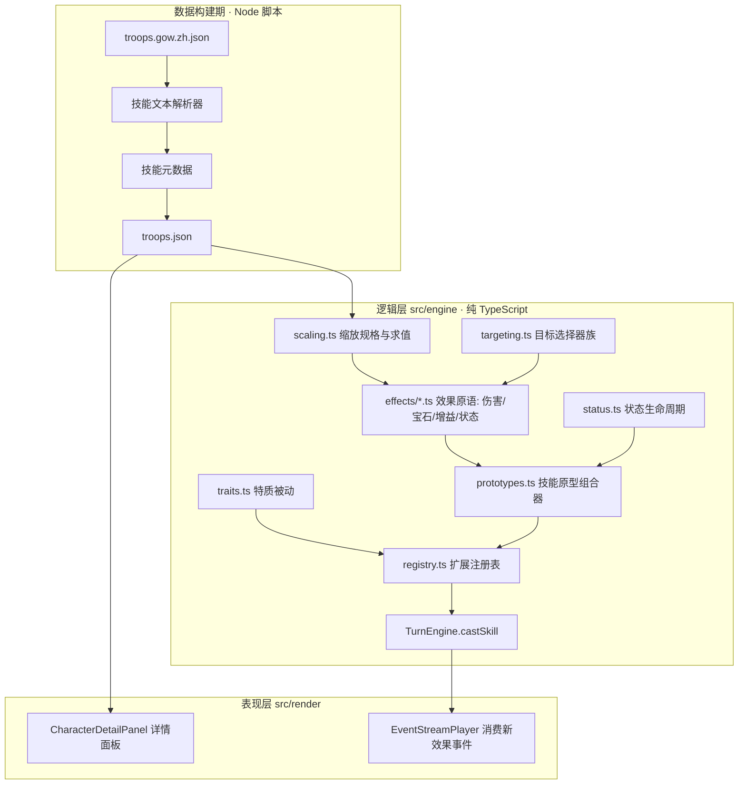
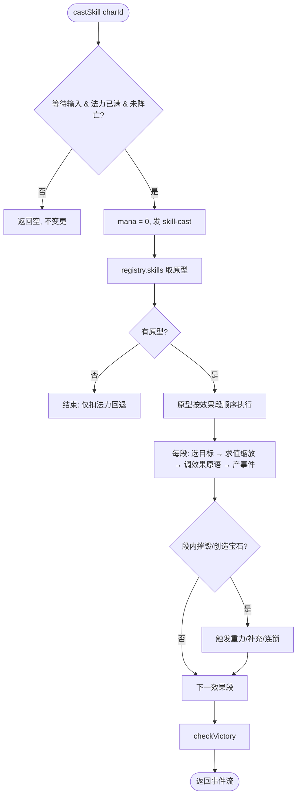

# 设计文档 · 战斗技能系统

## 概述

本设计在 `match3-battle-core` 的纯逻辑引擎之上，自底向上构建技能系统。核心理念：**技能 = 目标选择 + 效果原语 + 数值缩放的组合**。我们不为 1798 条技能各写实现，而是先把它们共用的底层原语一层层夯实，每层可独立测试，再用参数化「技能原型」把原语编排起来。

分层依赖（后者依赖前者）：

```
数值缩放解析(Scaling) ─┐
技能元数据管线(Metadata) ┤→ 目标选择(Targeting) → 效果原语(伤害/宝石/增益) → 状态系统 → 特质/召唤 → 技能原型组合与注册
详情查看(UI，独立)  ────┘
```

延续 `match3-battle-core` 的约束：逻辑层纯净（`src/engine` 不依赖 pixi/gsap/dom）、确定性（种子化 RNG）、事件驱动（引擎只产事件，表现层只消费）、可测试。

## 关键设计决策

1. **数据构建期解析，运行期不碰文本**：中文技能描述在 `build_troops.mjs` 阶段一次性预解析为结构化元数据写入 `troops.json`。运行时逻辑层只读结构化数据，保证纯净与确定性，也避免中文解析散落各处。
2. **缩放是纯数据 + 纯函数**：`ScalingSpec` 是可序列化的数值公式，`evaluate(spec, magic)` 是纯函数。技能原型只调用它，不知道任何文本。
3. **效果原语直接操作引擎子系统**：伤害复用 `CombatResolver` 的护甲/阵亡逻辑，宝石操作复用 `GravitySystem` 的重力补充与 `TurnEngine` 的连锁，避免重复实现规则。
4. **技能原型声明式组合**：一个原型是「目标模式 + 效果段数组 + 参数」的数据描述，执行器按序解释它。新增技能多数只是新增一条数据，而非新代码。
5. **表现层详情查看零耦合**：详情面板只读 `Character` 与 `TroopData`，不触碰引擎状态，可随时打开。

## 分层与模块



## 数据模型

### 缩放规格 ScalingSpec

覆盖统计到的全部标记：`[魔法 + N]`(1250)、`[(魔法 x M)+N]`/`[(魔法 x M.M)+N]`/`[(魔法 / D)+N]`(187)、`[魔法]`(19)、纯常数。

```typescript
/** 数值公式：value = round(base + magic * mult)。纯常数则 mult=0。 */
export interface ScalingSpec {
  base: number;   // 常数项 N
  mult: number;   // 魔力系数：默认 1；[魔法 x M]→M；[魔法 / D]→1/D；纯常数→0
}

/** 二级修饰：技能数值随战场资源数量二次缩放（本阶段解析+保存，效果在伤害/宝石批次实现） */
export interface SecondaryModifier {
  kind: 'multiplier' | 'ratio';
  // multiplier: [xN] → { kind:'multiplier', a:N }
  // ratio:      [N:M] → { kind:'ratio', a:N, b:M } 表示每 N 个来源提供 M
  a: number;
  b?: number;
}

export function evaluateScaling(spec: ScalingSpec, magic: number): number {
  return Math.max(0, Math.round(spec.base + magic * spec.mult));
}
```

### 技能元数据 SkillMetadata（写入 troops.json）

```typescript
export interface SkillMetadata {
  /** 描述中按出现顺序解析出的魔法缩放（伤害额、护甲额、数量…各占一个） */
  scalings: ScalingSpec[];
  /** 二级修饰标记（可能 0~1 个） */
  modifier?: SecondaryModifier;
  /** 原始描述文本，供详情面板与回退 */
  raw: string;
  /** 是否被结构化规则完整识别（false → 运行时回退为仅扣法力） */
  parsed: boolean;
}
```

> `TroopData.spell` 扩展为 `{ id, name, description, meta: SkillMetadata }`。`build_troops.mjs` 负责填充 `meta`；无法识别时 `parsed=false` 并保留 `raw`，不中断构建（需求 2.3）。

### 目标模式 TargetMode

```typescript
export type TargetMode =
  | 'enemyFront'    // 敌方队首存活（默认普攻/多数指定技能）
  | 'enemyRandom'
  | 'enemyWeakest'  // 最低生命
  | 'enemyHealthiest'
  | 'enemyFirstN'   // 前 N 名
  | 'enemyLast'
  | 'enemyAll'
  | 'allySelf'
  | 'allyFront'
  | 'allyRandom'
  | 'allyAll';
```

生命口径：`weakest/healthiest` 以 `hp`（不含护甲）为准，平局取队伍索引更小者（需求 5.2）。随机模式用注入的 `SeededRNG`（需求 5.4）。

## 核心算法与流程

### 缩放解析（构建期）

```
对每条技能 desc:
  scalings = []
  依次匹配以下模式（正则），按出现位置排序：
    [魔法 + N]        → { base:N,  mult:1 }
    [魔法]            → { base:0,  mult:1 }
    [(魔法 x M) + N]   → { base:N,  mult:M }
    [(魔法 x M.M) + N] → { base:N,  mult:M.M }
    [(魔法 / D) + N]   → { base:N,  mult:1/D }
    [(魔法 / D)]       → { base:0,  mult:1/D }
  modifier:
    [xN]   → { kind:'multiplier', a:N }
    [N:M]  → { kind:'ratio', a:N, b:M }
  parsed = 至少识别出上述任一结构 或 该技能本就无缩放（纯文本效果另行标注）
```

### 技能释放流程（运行期，扩展 TurnEngine.castSkill）



### 效果原语接口

```typescript
export interface EffectContext {
  state: GameState;
  casterId: number;
  rng: SeededRNG;
  magic: number;
  scalings: ScalingSpec[];
  modifier?: SecondaryModifier;
  nextGemId: () => number;
}

export interface EffectPrimitive {
  apply(ctx: EffectContext): GameEvent[];
}
```

- **伤害原语**：`select(targets) → 逐个 evaluateScaling → CombatResolver 施伤（先护甲后血/真实伤害跳护甲）→ 伤害事件 + 阵亡事件`。范围 single/all/splash（需求 6）。
- **宝石原语**：对 `BoardModel` 执行 创造/转化/摧毁；摧毁后交回 `TurnEngine` 的连锁子流程走重力补充与法力/骷髅结算（需求 7.3、7.5）。
- **增益原语**：对己方目标改 attack/armor/hp/mana/magic，夹在各自上限内（需求 8.3、8.4）。
- **状态原语**：向 `Character.statuses` 施加状态实例（见状态系统）。

### 状态系统

```typescript
export interface StatusInstance {
  id: string;        // 'poison' | 'burning' | 'silence' | ...
  turns: number;     // 剩余回合
  magnitude?: number;// DoT 伤害量等
}
```

- 存于 `Character.statuses`（`match3-battle-core` 已预留字段）。
- 结算时机：在 `TurnEngine.finishTurn` 之前、对**即将行动方**的角色触发 `onTurnStart`（DoT 扣血、控制标记）；`turns` 递减到 0 移除（需求 9.4、9.5）。
- 控制类：`silence` 使 `castSkill` 拒绝；`stun` 使该角色本回合行动被跳过（具体口径在实现时固定并测试）。

### 事件扩展（events.ts）

新增（均带足够动画数据，需求 3.2）：

```typescript
| { type: 'skill-damage'; casterId:number; targetId:number; damage:number; resultingHp:number; resultingArmor:number; }
| { type: 'gem-create'; spawns: { pos:CellPos; gemId:number; gemType:GemType }[]; }
| { type: 'gem-transform'; changes: { pos:CellPos; from:GemType; to:GemType }[]; }
| { type: 'gem-destroy'; cells: { pos:CellPos; gemId:number; gemType:GemType }[]; }
| { type: 'buff'; targetId:number; stat:'attack'|'armor'|'hp'|'mana'|'magic'; amount:number; }
| { type: 'status-apply'; targetId:number; statusId:string; turns:number; }
| { type: 'status-tick'; targetId:number; statusId:string; damage?:number; }
| { type: 'status-expire'; targetId:number; statusId:string; }
| { type: 'summon'; player:PlayerSide; slot:number; troopId:number; }
```

`skill-cast` 保持不变，作为一次释放的首事件；效果事件紧随其后（需求 3.3）。

## 表现层：详情面板（需求 4，可独立先行）

- `CharacterDetailPanel`：DOM 覆盖层，点击角色卡打开。读 `Character`（hp/armor/attack/magic/mana/manaCost/colors）与该角色对应的 `TroopData`（技能名、`spell.description`、traits）。
- 点击卡片打开、点击面板外或关闭钮隐藏；纯读，不改引擎（需求 4.5）。
- 与现有 `TeamView` 的宝石浮窗共存；技能全文与特质列表来自数据加载器。

## 测试策略

### 单元测试
- 缩放解析：逐一覆盖 6 类魔法标记 + `[xN]`/`[N:M]` + 纯常数；`evaluateScaling` 边界（magic=0、除数、四舍五入、非负下限）。
- 目标选择：各模式选中正确、平局确定性、排除阵亡、无目标返回空、随机用种子可复现。
- 伤害原语：先护甲后血、真实伤害跳护甲、全体/溅射、阵亡事件。
- 宝石原语：创造/转化/摧毁后棋盘正确、触发连锁、法力/骷髅结算。
- 增益原语：不越上限、作用己方。
- 状态系统：DoT 扣血、控制拒绝技能、到期移除、结算时机确定。
- 技能原型：多效果段按序执行、未支持机制回退不崩溃。

### 属性测试（fast-check）
- 缩放非负：任意 spec 与 magic≥0，`evaluateScaling ≥ 0` 且为整数。
- 法力/生命不越界：任意增益/伤害序列后 `0≤hp≤maxHp`、`0≤mana≤manaCost`。
- 确定性：相同状态 + 相同种子 + 相同技能 → 相同事件流。
- 事件流排序：`skill-cast` 在效果事件之前，`game-over` 在末尾。
- 元数据构建稳定：同一 dump 多次构建产出一致。

## 项目结构（新增/改动）

```
src/engine/
  skills/
    scaling.ts        # ScalingSpec, evaluateScaling, 解析器（供构建脚本与运行时共用类型）
    targeting.ts      # TargetMode 与选择器族
    effects/
      damage.ts
      gems.ts
      buff.ts
      status.ts
    prototypes.ts     # 技能原型组合器与注册
  status.ts           # 状态生命周期（或并入 skills/effects/status.ts）
  traits.ts           # 特质被动钩子
  events.ts           # 扩展效果事件（改动）
  TurnEngine.ts       # castSkill 接入原型执行（改动）
  registry.ts         # 注册技能原型（改动）
src/data/
  troops.ts           # SkillMetadata 类型与暴露（改动）
scripts/
  build_troops.mjs    # 增加技能元数据解析（改动）
src/render/
  CharacterDetailPanel.ts  # 详情面板（新增）
tests/unit/ , tests/property/  # 对应测试
```
