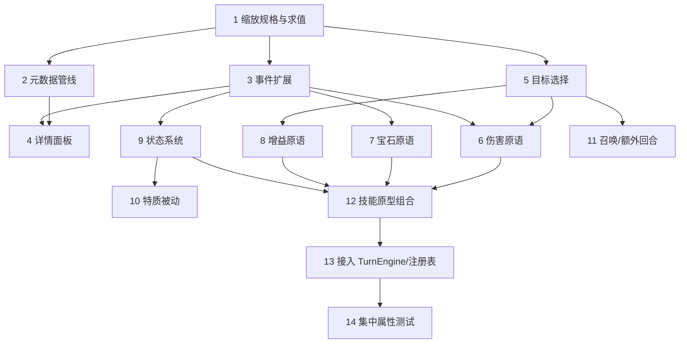

# 实施计划 · 战斗技能系统

## 说明

> 自底向上，按**机制原语**分批。每批只依赖前面已夯实的原语，均可独立测试。
> **第 0 批（基建）优先**——数值缩放、元数据管线、事件扩展、详情查看，是后续所有技能的地基。
> 逻辑层任务随任务编写单元测试；标 `*` 为可选/属性测试任务。逻辑层 `src/engine` 禁止 import pixi/gsap/dom。

## 任务

### 第 0 批 · 数值系统与基建（优先落地）

- [x] 1. 实现魔法缩放规格与求值 `src/engine/skills/scaling.ts`
  - 定义 `ScalingSpec { base, mult }`、`SecondaryModifier`（multiplier/ratio）、`SkillMetadata`
  - 实现 `evaluateScaling(spec, magic)` = `max(0, round(base + magic*mult))`
  - 实现 `parseScalings(desc)`：解析 `[魔法 + N]`、`[魔法]`、`[(魔法 x M)+N]`、`[(魔法 x M.M)+N]`、`[(魔法 / D)+N]`、`[(魔法 / D)]`，按出现顺序产出多个 spec；解析 `[xN]`/`[N:M]` 为 modifier
  - 编写单元测试：逐类标记、多标记顺序、纯常数、无法识别
  - _需求: 1.1, 1.2, 1.4, 1.5, 1.6_

- [x]* 1.1 缩放求值与解析的属性测试
  - 属性：任意 `spec` 与 `magic≥0`，`evaluateScaling` 结果为非负整数
  - 属性：`parseScalings` 为纯函数（同输入同输出、幂等）
  - _需求: 1.3, 1.6_

- [x] 2. 技能元数据预处理管线（`scripts/build_troops.mjs` + `src/data/troops.ts`）
  - 在 `build_troops.mjs` 复用/内联缩放解析，为每条技能产出 `meta: SkillMetadata`（scalings/modifier/raw/parsed）写入 `troops.json`
  - 扩展 `TroopData.spell` 类型为 `{ id, name, description, meta }`，并暴露给消费方
  - 无法解析时 `parsed=false`、保留 `raw`、不中断构建
  - 重新运行构建生成新 `troops.json`，编写测试断言若干已知技能的 meta 正确
  - _需求: 2.1, 2.2, 2.3, 2.4_

- [x]* 2.1 元数据构建确定性测试
  - 属性/断言：同一输入 dump 多次构建产出一致的 meta
  - _需求: 2.5_

- [x] 3. 扩展技能效果事件类型 `src/engine/events.ts`
  - 新增 `skill-damage`、`gem-create`、`gem-transform`、`gem-destroy`、`buff`、`status-apply`、`status-tick`、`status-expire`、`summon` 事件，均带足够动画标识数据
  - 纳入 `GameEvent` 联合类型；保持 `skill-cast` 为释放首事件的约定
  - _需求: 3.1, 3.2, 3.3_

- [x] 4. 实现角色/技能详情面板 `src/render/CharacterDetailPanel.ts`
  - 点击角色卡打开 DOM 详情面板：名称、生命/护甲、攻击、魔力、法力(当前/需求)、关联颜色、技能名+全文+法力消耗、全部特质(名称+描述)
  - 数据来源：`Character` + 该角色对应 `TroopData`（经数据加载器）；点击外部/关闭钮隐藏；纯读不改引擎
  - 接入 `TeamView`/`App` 的角色卡点击（与既有法力浮窗共存）
  - _需求: 4.1, 4.2, 4.3, 4.4, 4.5_

### 第 1 批 · 目标选择系统

- [x] 5. 实现目标选择器族 `src/engine/skills/targeting.ts`
  - 实现 `TargetMode` 全部模式：enemyFront/Random/Weakest/Healthiest/FirstN/Last/All 与 ally 对应模式
  - 排除阵亡；weakest/healthiest 以 hp 为准、平局取索引更小；随机用种子化 RNG；无目标返回空
  - 编写单元测试覆盖各模式与边界
  - _需求: 5.1, 5.2, 5.3, 5.5_

- [x]* 5.1 目标选择属性测试
  - 属性：随机目标用同种子结果一致；选中集恒不含阵亡角色
  - _需求: 5.4, 5.3_

### 第 2 批 · 伤害效果原语（覆盖最大，约 58%）

- [x] 6. 实现伤害原语 `src/engine/skills/effects/damage.ts`
  - 按缩放+魔力求值伤害，施于目标；先护甲后血、真实/穿透跳护甲；单体/全体/溅射范围
  - hp≤0 标记阵亡并发 `defeat`；每目标发 `skill-damage` 事件（复用 `CombatResolver` 规则）
  - 编写单元测试：护甲优先、真实伤害、全体、溅射、阵亡
  - _需求: 6.1, 6.2, 6.3, 6.4, 6.5_

### 第 3 批 · 宝石操作原语（约 40%）

- [x] 7. 实现宝石操作原语 `src/engine/skills/effects/gems.ts`
  - 创造指定色/骷髅、转化某色→某色、摧毁整行/整列、摧毁所有指定色；数量可由缩放求值
  - 操作后交回 `TurnEngine` 连锁子流程：重力补充 + 法力/骷髅结算 + 连锁
  - 发 `gem-create`/`gem-transform`/`gem-destroy` 事件
  - 编写单元测试：各操作后棋盘正确、触发连锁、法力/骷髅结算
  - _需求: 7.1, 7.2, 7.3, 7.4, 7.5_

### 第 4 批 · 增益与资源原语（约 35%）

- [x] 8. 实现增益原语 `src/engine/skills/effects/buff.ts`
  - 加攻击/护甲、恢复生命、加法力、加魔力，作用于己方目标；数额按缩放求值
  - hp 不超 maxHp、mana 不超 manaCost；每次变更发 `buff` 事件
  - 编写单元测试：不越界、作用己方
  - _需求: 8.1, 8.2, 8.3, 8.4, 8.5_

### 第 5 批 · 状态效果系统

- [x] 9. 实现状态生命周期 `src/engine/skills/effects/status.ts`
- [x] 9.1 状态数据与施加/结算/移除
  - `StatusInstance { id, turns, magnitude }` 存入 `Character.statuses`；施加发 `status-apply`
  - 在回合流程固定时机结算：DoT(中毒/燃烧)扣血发 `status-tick`；turns 归零移除发 `status-expire`
  - 编写单元测试：DoT 扣血、到期移除、结算时机确定
  - _需求: 9.1, 9.2, 9.4, 9.5_
- [x] 9.2 控制类状态
  - 沉默禁用 `castSkill`；眩晕跳过行动；存续期限制对应行为
  - 编写单元测试覆盖沉默拒绝释放、眩晕跳过
  - _需求: 9.3_

### 第 6 批 · 特质被动、召唤、额外回合

- [x] 10. 实现特质被动钩子与高频特质 `src/engine/skills/traits.ts`
  - 提供 战斗开始/回合开始/受击/阵亡 钩子，经注册表接入回合循环
  - 实现覆盖面最广的一批高频特质（armored/stoneskin/spellarmor 等）
  - 编写单元测试覆盖若干特质
  - _需求: 10.1, 10.4, 10.5_

- [x] 11. 实现召唤与额外回合技能效果
  - 额外回合效果：使当前玩家保留回合（复用回合经济）
  - 召唤：队伍空位生成指定兵种；无空位安全跳过；发 `summon`
  - 编写单元测试覆盖额外回合保留、召唤入空位/无空位
  - _需求: 10.2, 10.3, 10.4_

### 第 7 批 · 技能原型组合与注册

- [x] 12. 实现技能原型组合器 `src/engine/skills/prototypes.ts`
  - `EffectContext`/`EffectPrimitive` 接口；原型 = 目标模式 + 效果段数组 + 参数，执行器按序解释
  - 多效果段按描述顺序执行；未支持机制回退为"仅扣法力"不崩溃
  - 编写单元测试：多段顺序执行、回退不崩溃
  - _需求: 11.1, 11.3, 11.4_

- [x] 13. 接入 TurnEngine 与注册表
  - `castSkill`：满则清零→发 `skill-cast`→查原型→执行效果段→触发连锁→checkVictory→末尾胜负事件
  - `skillId` 解析到原型+参数并注册进 `ExtensionRegistry.skills`
  - 编写单元测试：一条含伤害+宝石+额外回合的组合技端到端产出正确事件流
  - _需求: 3.1, 3.3, 11.2, 11.5_

- [x]* 14. 战斗技能系统属性测试（集中）
  - 缩放非负；任意增益/伤害序列后 hp∈[0,maxHp]、mana∈[0,manaCost]
  - 技能释放确定性（相同状态+种子→相同事件流）；事件流排序合法（skill-cast 先、game-over 末）
  - _需求: 12.1, 12.2, 12.3, 12.4, 12.5_

## 依赖关系

**关键路径**：1 → 2/3 → 5 → 6/7/8 → 12 → 13。第 0 批（1-4）是所有后续批次的地基，务必先完成并测稳。

## 备注

- **第 0 批目标**：数值缩放解析、元数据写入 `troops.json`、效果事件类型、角色详情面板——完成后即有"看得见的详情查看"与"技能数值的统一来源"，为技能真正生效铺好地基。
- **回退策略**：任一技能机制暂未被原语支持时，`castSkill` 回退为仅扣法力、不产战斗效果、不崩溃（需求 11.4），保证增量推进期间对局始终可玩。
- **测试框架**：Vitest + fast-check，沿用 `match3-battle-core`。
- **清理**：`scripts/_analyze_*.mjs` 与 `_*_report.txt` 为一次性分析产物，可在本阶段结束后删除。
