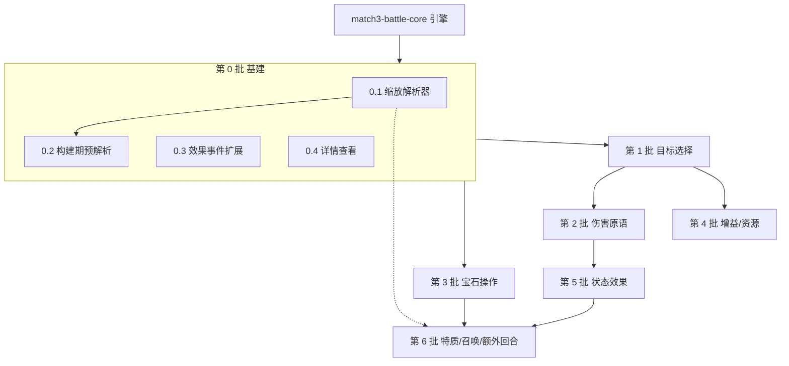

# 实施计划：战斗机制与技能系统（向 GoW 靠拢）

## 概述

本阶段在 `match3-battle-core` 已完成的引擎之上，把「可释放但无效果」的技能框架逐层填充为真正的战斗内容，目标是让 1798 个兵种的技能能按《Gems of War》的语义实际生效。

**核心原则：底层机制优先，分批推进。** 技能不是独立实现的，它是底层机制原语的编排。因此不按「兵种」拆任务，而按「机制原语」分层：每一批交付一组可独立单元测试、且能被后续批次复用的原子能力；后一批只依赖前面已夯实的原语。技能最终只是「选目标 + 调原语 + 套魔法缩放」的组合。

**关键区分（已在引擎落地）：**
- **法力（mana / manaCost）**：技能充能。累积到 manaCost 即满，满则可释放，释放后清零。
- **魔力（magic）**：法术强度。决定技能数值，可作加值（`[魔法+N]` 点伤害）也可直接作数量（摧毁 `[魔法+1]` 颗宝石）。

## 事实依据（来自 `src/data/troops.json` 统计）

- **缩放标记**（1552/1798 条技能含方括号标记）：`[魔法 + N]` 1250 · `[xN]` 476 · `[N:M]` 362 · `[(魔法 x M) + N]` / `[(魔法 / D) + N]` 等带系数 187 · `[魔法]` 19。
- **机制原语覆盖率**：造成伤害 58%（单体 54% / 全体 14% / 溅射 3% / 穿透 5%）· 宝石操作 ~40%（创造 18% / 转化 13% / 摧毁 17%，其中摧毁指定色 16%）· 增益 ~35%（治疗 13% / 护甲 10% / 加法力 12% / 加攻 8%）。
- **状态效果**：单个占比均 <5%（诅咒 4.4% / 燃烧 3.7% / 中毒 2.7% / 屏障 4.2% …），是长尾，故排在伤害/宝石/增益之后。
- **目标措辞**：单体 / 随机 / 最弱 / 最健康 / 前 N 名 / 最后一名 / 全体 —— 伤害类技能的普遍前置。
- **其它**：额外回合 9.9% · 召唤 7.8% · 二次缩放（[xN]/[N:M] 随棋盘资源数量）。

## 批次路线图

| 批次 | 主题 | 覆盖 | 依赖 |
|------|------|------|------|
| **第 0 批** | 基建（缩放解析 · 事件 · 详情查看） | 全体前置 | core |
| 第 1 批 | 目标选择系统 | 伤害类前置 | 第 0 批 |
| 第 2 批 | 伤害原语 | ~58% | 第 1 批 |
| 第 3 批 | 宝石操作原语 | ~40% | 第 0 批 |
| 第 4 批 | 增益 / 资源原语 | ~35% | 第 1 批 |
| 第 5 批 | 状态效果系统 | 长尾累积 | 第 2 批 |
| 第 6 批 | 特质被动 · 召唤 · 额外回合技能 | 收尾 | 第 3/5 批 |

---

## Tasks

### 第 0 批：技能基建（当前批次）

- [ ] 0.1 魔法缩放解析器与类型（纯逻辑）
  - 在 `src/engine/skills/scaling.ts` 定义 `ScalingSpec`（`{ base: number; magicCoeff: number; magicDiv?: number }`，表达 `magic × coeff / div + base`）、`MultiplierSpec`（`[xN]`）、`RatioSpec`（`[N:M]`，每 N 个来源 +M）
  - 实现 `parseScaling(desc)`：解析 `[魔法 + N]`、`[魔法]`、`[(魔法 x M) + N]`、`[(魔法 x M.M) + N]`、`[(魔法 / D) + N]`、`[xN]`、`[N:M]` 全部格式，返回结构化结果 + 原始文本
  - 实现 `evaluate(spec, magic)`：由 magic 算出基础数值（向下取整规则明确）
  - 单元测试覆盖全部标记格式与边界（含统计中出现的具体值 N=1..40、[1:1]/[3:1]、[x2]/[x10]）
  - _依据：GAP-1、缩放标记体系；未识别标记必须显式报错而非静默忽略_

- [ ] 0.2 构建期技能预解析（`scripts/build_troops.mjs`）
  - 在抽取阶段调用解析器，把每条技能预解析为结构化 `spellMeta`（scaling / multiplier / ratio / 主效果关键词）写进 `troops.json`
  - `TroopData.spell` 类型补上 `meta` 字段；运行时不再解析中文文本
  - 构建脚本输出「解析覆盖率报告」：多少条技能带标记、多少条完全解析、列出未识别标记的技能供人工核对
  - _依据：解析属构建期一次性工作，运行时零文本解析；1798 条须全部过一遍_

- [ ] 0.3 技能效果结果事件扩展（纯逻辑）
  - 扩展 `SkillCastEvent`（或新增 `skill-effect` 子事件）以携带结构化效果结果：伤害/治疗/护甲变化、造/毁的宝石、施加的状态、目标 id 列表
  - 保证事件流排序契约不破（技能事件在其触发的 mana/damage/defeat 之前，终结事件仍在末尾）
  - 更新 `events.ts` 联合类型与相关单元测试
  - _依据：需求 18；表现层需靠事件自带数据演出，不回查引擎状态_

- [ ] 0.4 角色详情查看（表现层基建）
  - 点击/长按角色卡展开详情面板：技能名 + 完整描述、特质（名称+描述）、全属性（攻/防/血/魔力/法力需求）、种族/稀有度
  - 数据来自 `TroopData`（App 需在建队时持有 troop 引用并传给 TeamView）
  - 纯 DOM，复用 card_7 视觉语言；移动端可点开/点关，桌面端 hover 或点击
  - _依据：GAP-8；这是调试后续所有机制的「眼睛」，须先有_

### 第 1 批：目标选择系统

- [ ] 1.1 扩展 `TargetSelector` 支持多种目标策略
  - 实现单体（队首）/ 随机 / 最弱（当前 hp 最低）/ 最健康 / 前 N 名 / 最后一名 / 全体 的选择器
  - 技能自带目标策略（不依赖全局 selector，全局 selector 仍只管普攻）
  - 阵亡角色一律排除；确定性（随机走种子化 RNG）
  - 单元测试覆盖各策略与空队伍/全阵亡边界
  - _依据：需求 14.6、20.4；目标措辞样本_

### 第 2 批：伤害原语（覆盖 ~58%）

- [ ] 2.1 单体伤害原语（覆盖 54%）
  - 技能效果：对选定目标造成 `evaluate(scaling, magic)` 点伤害，走现有「先护甲后血」结算，复用 CombatResolver 的扣血/阵亡逻辑
  - 发出结构化伤害结果事件；触发阵亡与胜负检查
  - 单元测试：伤害数值随 magic 正确、护甲吸收、阵亡
- [ ] 2.2 全体 / 多目标伤害（覆盖 14%）
  - 支持「所有敌人」「前 N 名」的批量结算
- [ ] 2.3 溅射与穿透伤害（覆盖 3%+5%）
  - 溅射：主目标全额 + 相邻分摊；穿透/真实伤害：无视护甲直接扣血

### 第 3 批：宝石操作原语（覆盖 ~40%）

- [ ] 3.1 摧毁类（覆盖 17%）
  - 摧毁指定色全部 / 整行 / 整列 / 指定数量（数量可为 `[魔法+N]`）；摧毁后走既有重力+补充+连锁管线
  - 摧毁产出的法力/伤害按既有规则结算
  - 单元测试：摧毁范围正确、触发连锁、事件顺序合法
- [ ] 3.2 创造类（覆盖 18%）
  - 在棋盘生成指定色/骷髅/炸弹等指定数量宝石，位置策略明确（随机空位或替换）
- [ ] 3.3 转化类（覆盖 13%）
  - 把某色宝石批量转成另一色；转化后重新检测匹配触发连锁

### 第 4 批：增益 / 资源原语（覆盖 ~35%）

- [ ] 4.1 属性增益（加攻 8% / 加护甲 10% / 治疗 13%）
  - 对自身/指定友方施加数值变化，数值走魔法缩放；治疗不超过 maxHp
- [ ] 4.2 资源操作（加法力 12% / 加魔力 / 窃取）
  - 为友方充法力、临时/永久加 magic、从敌方窃取护甲/魔力转化

### 第 5 批：状态效果系统（GAP-6，长尾累积）

- [ ] 5.1 状态生命周期框架
  - 实现 `StatusEffect` 从空壳到可运作：施加 → 回合钩子（`onTurnStart`）→ 到期移除；在 TurnEngine 回合流程中真正调用（当前从不调用）
  - 单元测试：叠加、层数递减、到期清除、阵亡清除
- [ ] 5.2 持续伤害类（燃烧 / 中毒 / 妖火 / 流血）
- [ ] 5.3 控制类（沉默禁技 / 眩晕 / 冰冻 / 缠绕 / 织网）
- [ ] 5.4 减益与增益状态（诅咒 / 屏障 / 荆棘 / 祝福 / 闪避）

### 第 6 批：特质被动 · 召唤 · 额外回合技能（收尾）

- [ ] 6.1 特质被动系统（GAP-4）
  - 复用状态钩子实现被动触发（战斗开始 / 受击 / 回合开始）；先覆盖 Top 20 高频特质（armored/undying/stoneskin/spellarmor/agile…）
  - troopType 羁绊联动（如 beastbond）
- [ ] 6.2 召唤（7.8%）：技能召唤新角色入队的机制与队列上限处理
- [ ] 6.3 技能授予额外回合（9.9%）：技能内触发额外回合，复用现有回合经济
- [ ] 6.4 二次缩放生效：让 `[xN]` / `[N:M]` 随棋盘资源数量实际增强伤害/数值（第 0 批已解析存好，此处接通效果）

---

## 依赖图

## 备注

- **测试要求**：所有 `src/engine` 逻辑层任务须随任务编写单元测试；解析器与原语是纯函数，优先覆盖。
- **确定性**：技能中的随机（随机目标、随机造宝石位置）一律经种子化 RNG，保持事件流可复现（需求 17.3）。
- **逻辑层纯净性**：`src/engine/skills` 同样禁止 import pixi/gsap/dom。
- **里程碑**：第 0-2 批完成即可让「伤害类技能」真正打出效果（覆盖过半兵种的主效果），是第一个可感知的验证点。
- 本 tasks 尚无配套 requirements.md / design.md。如需严格 spec 驱动，可在开工第 0 批前补齐这两份文档。
