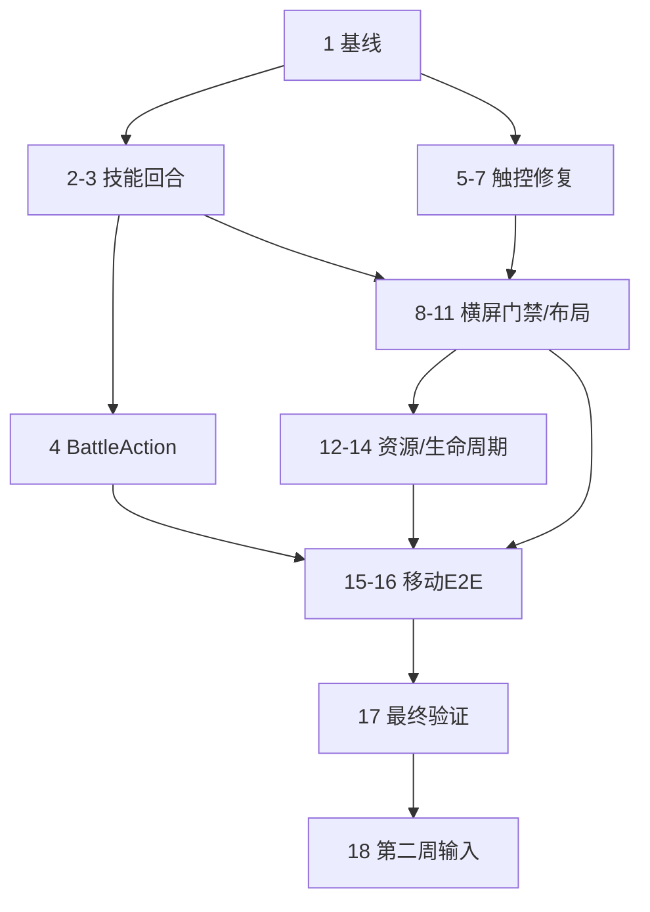

# 实施计划 · 产品化路线

## 说明

- 本文把第一周拆成可顺序执行的任务；完成一项后立即勾选并记录验证结果。
- 第一周目标是“规则正确 + 手机横屏基础可靠”，不接完整 AIRP、不批量制作技能。
- 手机竖屏战斗明确不在范围内；只实现旋转门禁。
- 修改逻辑层时保持 `src/engine` 无 DOM/Pixi/GSAP 依赖。
- 不用单纯增加 E2E 超时掩盖资源或生命周期问题。

# 第一周冲刺

## 周目标 / Definition of Done

第一周结束时必须满足：

1. 普通技能释放后正确结束回合，额外回合技能只保留当前方一次行动。
2. 技能与交换共享统一回合尾结算，不存在额外回合信号泄漏。
3. 手机竖屏显示旋转引导且不能操作战场；旋转至横屏可恢复。
4. 手机横屏不会因法力宝石、移动取消、多指或 pointercancel 误释放技能/卡住拖动。
5. 844×390、852×393、915×412 下战场完整可见，关键控制拥有至少 44×44 CSS px 触控区。
6. App 首屏不再等待全部技能序列帧解码；单个非关键资源失败不阻塞开战。
7. `npm run build`、`npm run lint`、单元/属性测试通过；关键移动 E2E 可稳定重复运行。

## 执行顺序

### Day 1 · 建立基线并修复技能回合

- [x] 1. 记录第一周修改前验证基线
  - 运行 `npm run build`、`npm run lint`、`npm test -- --run`。
  - 单独记录当前 E2E 的资源超时与开发服务器退出，不把环境失败混为功能失败。
  - 保存技能释放事件序列的最小复现：普通技能无 `turn-end`。
  - 交付：任务记录中附基线结果。

- [x] 2. 将技能释放纳入统一行动生命周期
  - 在 `src/engine/TurnEngine.ts` 中让 `castSkill` 进入 Resolving。
  - 技能效果、宝石变化、连锁、阵亡与胜负结束后调用统一回合尾逻辑。
  - 普通技能切换行动方；额外回合技能保留当前方。
  - GameOver 后不得再 tick、reshuffle 或切换行动方。
  - 确保 `pendingExtraTurn` 在一次行动结束时消费并清零。
  - 相关需求：requirements 1.1～1.6。

- [x] 3. 覆盖技能回合核心场景
  - 普通伤害技能：事件末尾存在 `turn-end`。
  - 额外回合技能：不产生对方 `turn-end`，当前方继续行动。
  - 技能触发棋盘连锁：连锁结束后只结算一次回合。
  - 技能致死：`game-over` 为末事件，不再产生 `turn-end`。
  - 状态致死与召唤空位：顺序保持确定。
  - 交付：相关逻辑验证通过。

**Day 1 验收：** 浏览器技能测试台释放“伤害+中毒”后交给敌方；释放“伤害+额外回合”后仍为玩家行动。

### Day 2 · 统一行动入口与修复触控状态机

- [x] 4. 定义 `BattleAction` 并建立统一提交入口
  - 新增 swap/cast 可辨识联合类型。
  - 玩家 App 与 AI 后续均可调用相同 action 执行入口。
  - 第一周允许保留旧方法作为薄包装，避免一次性大范围改动。
  - 行动日志至少能记录类型、行动方、角色/格子和 action index。

- [x] 5. 修复 CharacterCard 短按/长按
  - 修改 `src/render/TeamView.ts` 中 `CharacterCard.bindPress`。
  - 绑定单一 `pointerId`，使用 pointer capture。
  - 增加 moved/cancelled 状态；超过阈值后抬起不得触发 short。
  - long 只触发一次，抬起不得再触发 short。
  - 处理 `pointercancel`、`lostpointercapture`、失焦清理。
  - 长按阈值调整到移动端更安全的 450～500ms，并以常量配置。

- [x] 6. 隔离法力宝石手势
  - 在法力宝石的 pointerdown/up/move/cancel 阶段阻止事件进入卡片手势。
  - 点击法力宝石只控制法力提示。
  - 长按法力宝石不得打开详情。
  - 满法力时点击法力宝石不得释放技能。

- [x] 7. 加固棋盘 Pointer 输入
  - 修改 `src/render/InputController.ts`，记录活动 pointerId。
  - 第二根手指不覆盖当前拖动。
  - 处理 pointer capture、pointercancel、滑出 canvas、方向变化和失焦。
  - 任一取消路径恢复 held/preview sprite、停止 ticker、清理 selection/drag 状态。
  - 一次手势最多发出一次 swap。

**Day 2 验收：** 短按、长按、移动取消、法力宝石、多指和 pointercancel 场景无误施法、无幽灵长按、无卡住宝石。

### Day 3 · 手机横屏门禁与紧凑布局基础

- [x] 8. 实现 OrientationGate
  - 手机竖屏只显示“请横屏继续战斗”及旋转图示。
  - 竖屏时禁用棋盘与角色输入，暂停 idle/hint。
  - 横屏恢复后重新计算布局并按 session 状态恢复输入。
  - 不把 `screen.orientation.lock()` 作为必要条件。

- [ ] 9. 建立 LayoutMetrics / viewport 适配层
  - 从 `App.init()` 中抽离固定布局计算。
  - 支持 `desktop-landscape` 和 `mobile-landscape-compact`。
  - 使用 mount 容器、`visualViewport` 和 safe-area 计算可用空间。
  - 使用 `ResizeObserver` 处理 iframe 尺寸变化。
  - 坐标转换读取显式 layout scale，不再解析 CSS transform 字符串。

- [ ] 10. 完成横屏基础 UI 约束
  - `index.html` 增加 `viewport-fit=cover`。
  - 应用安全区 padding/inset。
  - 全屏和队伍调试控制移到不随战场缩小的控制层；触控区至少 44×44。
  - 捕获 `requestFullscreen()` 拒绝并显示降级反馈。
  - localStorage 访问失败时回退默认 3v3。
  - 正式版本预留隐藏 3v3/4v4 调试开关的配置。

- [x] 11. 紧凑横屏尺寸验收
  - 844×390、852×393、915×412：双方、棋盘、HUD 完整可见。
  - 667×375：达到最低可玩标准；若安全区后不足则显示尺寸不支持提示。
  - 无非预期横向/纵向滚动。
  - 棋盘格有效触控区目标 ≥40px。

**Day 3 验收：** 手机竖屏无法误操作战斗；旋转横屏无需刷新即可正常拖动和施法。

### Day 4 · 首屏资源与移动生命周期

- [ ] 12. 拆分 Critical / Battle-required / Deferred 资源
  - `App.init()` 不再 `await preloadAllFrameFX()`。
  - Critical 仅包含棋盘、宝石、基础卡片和 HUD。
  - 根据本场双方技能/状态收集 Battle-required 特效。
  - 其余资源在 idle 时预取或首次使用时加载。
  - 资源加载增加超时和失败降级。

- [ ] 13. 增加最小加载状态
  - 初始化期间显示加载文本或进度。
  - Critical 完成后立即显示并允许进入战斗准备态。
  - Battle-required 未完成时不应展示无反馈空白；失败使用程序化效果或跳过纯表现。

- [x] 14. 控制移动渲染成本
  - Pixi DPR 默认封顶 2；预留低端降级配置。
  - 检查大型 strip 缓存，避免开局全部常驻。
  - `visibilitychange` 时暂停 idle、hint 和非必要 ticker；恢复后继续。
  - AudioContext suspended 时在页面恢复或下一次用户手势中 resume。

**Day 4 验收：** 弱网/失败注入下基础战场仍能出现；未参战技能特效不会阻塞首屏；切后台后非必要动画停止。

### Day 5 · 自动化、真机矩阵与收口

- [ ] 15. 增加移动视口和触控回归场景
  - Playwright 增加 844×390、915×412、390×844 项目或参数化用例。
  - 竖屏断言 OrientationGate 可见且战斗输入关闭。
  - 横屏覆盖拖动交换、短按、长按、移动取消、法力宝石隔离和 pointercancel。
  - iframe resize 后验证棋盘选格/选目标坐标。
  - 测试台若纳入移动调试，增加“点技能→点角色分配”备用流程；否则明确标记为桌面内部工具。

- [ ] 16. 稳定关键 E2E
  - 定位资源解码超时和 Vite 测试服务器退出原因。
  - 将资源表现测试与核心功能测试分组，避免单个重资源用例击穿整个套件。
  - 不通过无限增加 timeout 作为最终解决方案。

- [ ] 17. 第一周最终验证
  - `npm run build`。
  - `npm run lint`。
  - `npm test -- --run`。
  - 关键 Playwright 桌面 + 手机横屏 + 竖屏门禁。
  - 浏览器手工验证普通技能/额外回合/AI 接管。
  - 至少一台 iOS Safari 和一台 Android Chrome 真机烟测；若设备不可用，明确记录未验证项。

- [x] 18. 第一周评审与第二周输入
  - 汇总已完成、遗留缺陷、性能数据和测试结果。
  - 冻结 `BattleAction` 与回合顺序。
  - 为第二周 BattleRequest/BattleResult 列出需要新增或迁移的 Character 字段。

**Day 5 验收：** 达成周 Definition of Done；未达成项必须带阻塞原因、影响和下一步，不得无说明顺延。

## 第一周执行记录（2026-08-30）

### 已交付

- 回合：新增 `BattleAction` 的 swap/cast 统一入口；交换和技能共用回合尾结算，额外回合只消费一次，GameOver 后不再切回合。
- Pointer：角色卡使用单 active pointer、capture、475ms 长按和 10px 移动取消；法力宝石隔离完整 pointer 生命周期；棋盘输入覆盖 cancel、capture 丢失、禁用归位和资源清理。
- 移动端：手机只支持横屏；竖屏/过小视口不初始化或禁用战场。横屏使用 538×352 紧凑基准、40px 逻辑格、safe-area、`100dvh`、`visualViewport` 和 `ResizeObserver`。
- 资源与生命周期：首屏不再等待全部技能序列帧；Critical 宝石资源与 Pixi 并行，Deferred FX 以 2 并发 idle 预取且支持按需解码/12s 超时降级；音频延迟到首次手势，renderer DPR 封顶 2；后台暂停输入、idle、hint 和音频。
- 自动化：测试台改用明确的 `data-test-ready` 契约，移除 700ms 固定等待；新增 Deferred FX 最终完成、法力宝石/移动取消/pointercancel 恢复，以及移动方向/布局/生命周期回归。

### 验证结果

| 检查 | 结果 |
|---|---|
| `npm run build` | 通过；主 App 2,350.10kB，gzip 436.18kB；仍有 `>500kB` chunk 警告 |
| `npm run lint` | 通过 |
| `npm test -- --run` | 36 files / 254 tests 通过 |
| Deferred FX E2E | 1/1 通过，约 18.3s |
| Pointer 组合回归 | 1/1 通过，约 15.3s |
| 移动布局与生命周期 E2E | 3/3 通过，连续两轮稳定，约 49～62s |
| 原关键技能 E2E | 1/1 通过，约 19.2s |
| 移动截图验收（Chromium 模拟移动端） | 5 张 `mobile-release-*` 全部人工核查通过 |

横屏尺寸自动化覆盖 844×390、852×393、915×412、667×375；均无 wrapper 越界，40px 逻辑格实际尺寸不低于 40 CSS px，全屏、队伍和法力宝石触控区不低于 44×44 CSS px。390×844 初始只有 OrientationGate 且 canvas 数量为 0；初始化后转回竖屏时 wrapper inert、输入关闭，再转横屏可恢复。DPR=3 环境下 Pixi resolution 为 2。hidden/visible 往返时输入、64 个 idle tween、hint 和 inert 状态按预期清理/恢复。

### 移动截图验收记录

环境：Playwright Chromium，`isMobile: true`、`hasTouch: true`、`deviceScaleFactor: 3`，Vite dev server。最终截图为工作区根目录的 `mobile-release-390x844-portrait.png` 与 `mobile-release-{667x375,844x390,852x393,915x412}-landscape.png`（早期 `mobile-*`/`mobile-final*`/`mobile-approved-*` 轮次已删除，避免与最终版本混淆）。

截图与运行时几何审计发现并修复的问题：

1. TURN HUD 遮挡首行宝石 → `App.ts` 预留 44px HUD 通道（`boardTopInset` 24→44，HUD 高度固定 44），HUD 底边与首行宝石顶边对齐（四个横屏尺寸实测间隙均为 0）。
2. 3v3 与全屏按钮压住底部角色卡 → 移到 wrapper 外侧（`left:-44px` / `right:-44px`），四个尺寸实测与末位角色卡重叠面积均为 0，且按钮完整落在视口内。
3. 竖屏旋转图标在 Chromium 截图中渲染异常 → 移除 `.gate-icon` 的 CSS 与 SVG 节点，只保留标题与说明；390×844 实测 `.gate-icon` 与 `svg` 节点数为 0、`canvas` 数为 0、`data-viewport-blocked=true`。
4. 末位角色卡底边溢出 wrapper 约 1px 并被视口裁掉 → `.gcard` 未用 `box-sizing:border-box`，1px 边框让实际占位比 `CARD_W`/`CARD_H` 各大 2px，与 `TeamView.totalHeight()` 的居中计算不一致；补 `border-box` 后四个尺寸的越界卡片数均为 0。
5. 卡面徽章、图标与数字整体过大 → 覆盖层尺寸全是按 512px 棋盘下的 142×164 卡写死的 px，紧凑基准把卡压到 101×114（4v4 为 94×83）后没有同步缩。新增 `overlayScale() = BOARD_PX / 512` 与 `os()` / `ofs()` 换算，把法力书签、水晶球角标、攻血/护甲数字与图标、状态徽章、四角内缩、底部纹饰和飘字统一按同一比例缩放（字号下限 9px）。法力书签另按 PC 设计稿单独锚定：设计源 `.superdesign/design_iterations/gem_emerald.html`（工作树已删，见 init 提交 `166bbe8`）里小卡 116×164 配 30px 宝石、大卡 232×328 配 50px，即占卡宽 25.9%～21.6%，且稿中宝石本体铺满整个方框、没有深色底板。原实现的 44px 是触控区下限而非设计比例，拿它反推会偏大，因此改为 `gemSize() = round(CARD_W * 0.26)`，内边距取边长的 19%。改后实测：法力书签占卡宽 25.7%（PC 稿 25.9%），水晶球角标占卡高 15.8%，血量整行占 29% 卡宽。SVG 自带的 `width`/`height` 属性由 CSS 覆盖，因此图标随之缩放。此项在桌面端同样生效——紧凑基准让 101×114 成为唯一卡片尺寸，桌面只是整体放大 1.75 倍，卡内比例原本一样偏差。

触控区口径调整（已确认）：法力宝石 `.gem` 视觉与触控区一并按比例缩小，从 44 逻辑 px 变为 26 逻辑 px（手机上 26.2～28.8 CSS px）。它是二级信息入口（点开法力进度浮窗），点击行为保留，但不再计入「关键控件 ≥44×44 CSS px」；全屏按钮、队伍人数按钮与角色卡本体仍满足 44×44。备选方案「保留 44px 透明触控区」被否决：那会在卡片左上角留下一块隐形区域，吃掉本该释放技能的点击。

回归护栏：`tests/e2e/mobileLayout.spec.ts` 的横屏参数化用例新增三类断言——底部两个控件与末位角色卡的重叠面积为 0、HUD 底边不越过首行宝石顶边（`hudGap >= -0.01`）、所有角色卡完整落在 wrapper 内。同时修掉一个既有竞态：`battle-wrapper` 在 `App.init()` 早期就入 DOM，而 `input`/`root` 到 `init()` 末尾才建好，`waitForBattle()` 现在显式等待两者就绪。44×44 断言集合改为只覆盖全屏与队伍人数按钮，法力宝石另立 ≥24 CSS px 的下限，守住「仍可点、没被缩没」。

实测格子尺寸：667×375 为 40.32px，844×390 为 41.94px，852×393 为 42.26px，915×412 为 44.30px。控制台仅有 WebGL 性能提示（`GPU stall due to ReadPixels`），无 JS 错误。

### 任务 4 行动日志

`GameState` 新增 `actionLog: ActionLogEntry[]`，由 `TurnEngine` 在行动被受理时追加、回合尾结算后回填：

```ts
interface ActionLogEntry {
  index: number;            // 本场第 n 次被受理的行动，从 0 递增
  side: PlayerSide;         // 提交方，取行动开始时的 activePlayer
  action: BattleAction;     // 行动快照（含类型与角色/格子），已拷贝
  skillId?: string;         // cast 时记录实际释放的技能
  outcome: ActionOutcome;   // 'switched' | 'extra-turn' | 'game-over'
}
```

设计取舍：

- 只登记进入解析态的行动。非相邻/不成匹配的交换、法力不足、角色不存在、被沉默/冰冻等拒绝路径既不登记也不占号，`index` 因此恒等于「本场第 n 次真实行动」，可直接用于复现和结果摘要。
- `action` 存整个 `BattleAction` 而非拆平字段，这样任务 18 冻结 `BattleAction` 后日志自动跟随，不需要同步两处结构。坐标做浅拷贝，调用方复用同一个 `CellPos` 对象不会回写历史条目。
- `outcome` 由回合尾结算后的真实状态推导（GameOver 优先于额外回合），不读 `pendingExtraTurnSource`，因此能直接用来校验「普通技能交出回合、额外回合只保留一次」而不必重新解析事件流。
- `passTurn()` 不进日志：它是调试/测试入口，也不属于 `BattleAction`。若第二周要做完整回放，需要先决定它是否升格为一种正式行动。
- 未纳入 `chainCount`：`state.chainCount` 只在 `runCascades()` 入口清零，不改变棋盘的施法不会重置它，会带上一次行动的残值。要记进日志得先把它改成按行动清零，那会影响 `resolveBoardChange()` 里 gravity/refill 事件的 chain 标号，超出本任务范围，另记为观察项。

验证：新增 `tests/unit/actionLog.test.ts` 7 个用例（交换登记、坐标快照隔离、拒绝路径不占号、施法登记技能 id、额外回合与普通技能的 outcome、致胜优先、index 单调递增）。`npm run lint`、`npm run build` 通过，`npm test -- --run` 为 37 files / 261 tests 通过（较上轮 +1 文件 +7 用例）。

### 任务 18 冻结项与第二周字段迁移清单

**已冻结（第二周不再改动，如需变更走版本号）**

- `BattleAction = { type:'swap'; from; to } | { type:'cast'; characterId }`。AI 与玩家共用 `resolveAction()`；`resolveSwap()`/`castSkill()` 保留为薄包装。
- 回合生命周期唯一出口 `finishTurn()`，次序为：执行行动 → 棋盘连锁 → 阵亡与召唤补位 → 胜负检查 → 消费额外回合或换方 → 对即将行动方 tick 状态 → 死局重排 → `AwaitingInput` 或 `GameOver`。
- `ActionLogEntry` 见上节；`index` 只在行动被受理时递增。
- 契约版本：`BATTLE_SCHEMA_VERSION = 1`、`RULESET_VERSION = '1.0.0'`。回合顺序或数值公式发生行为变化时递增 ruleset。

**`Character` → `CombatantSnapshot` 字段对照**

| 引擎 `Character` | `CombatantSnapshot` | 说明 |
|---|---|---|
| `id: number` | `externalId: string` | 内部 numeric id 由 session 层分配（player 0..3、enemy 4..7），宿主只见 externalId |
| `name` | `name` | 直传 |
| `maxHp` / `hp` | `stats.hp` | 开战即满血，快照不带当前血量 |
| `attack` / `armor` / `magic` | `stats.attack` / `stats.armor` / `stats.magic` | 直传 |
| `colors` | `manaColors` | 直传，需非空且不重复 |
| `manaCost` | `manaCost` | 直传 |
| `mana` | 不接收 | 开战恒为 0，不允许宿主预置法力 |
| `skillId` | `skillId` | 必须已注册，否则开战前报错（需求 2.6） |
| `statuses` | 不接收 | 开战恒为空，跨场状态不在本阶段范围 |
| `defeated` | 不接收 | 派生字段 |
| 无 | `templateId?` / `portraitUrl?` / `levelLabel?` | 仅展示与追溯，引擎不读 |
| 无 | `traitIds` | 引擎侧 traits 未实现（GAP-4），本阶段只接受空数组 |

**第二周需要新增的引擎侧字段：无。** `traitIds` 落到第四周随 traits 系统一起接 `Character`；`hp`/`armor` 双耐久（GAP-5）不在第二周范围。

**已实现（第二周第 1、2 项 + 结果导出）**

`src/session/`，新增别名 `@session/*`（tsconfig / vite / vitest 三处同步）：

- `contract.ts`：`BattleRequest`、`CombatantSnapshot`、`BattleResult`、`CombatantResult`、`BattleEventSummary` 与两个版本常量。设计文档只给了 `BattleResult` 引用了 `CombatantResult`/`BattleEventSummary` 而未定义，这里补全为「最终 hp/maxHp/armor/defeated/statuses」与「按事件类型计数」，另加 `summonedCount`——召唤物没有 externalId，不进 `combatants`，但宿主需要知道场上发生过召唤。
- `validateRequest.ts`：一次返回全部问题（`path` + `code` + `message`），覆盖 schema/ruleset 版本、必填、seed 必须整数、队伍人数 1～4、externalId 跨双方唯一、属性区间、法力颜色非空/已知/不重复、技能已注册、特质已注册。未注册技能与特质都是开战前硬失败，不做静默降级。
- `combatantMapping.ts`：`player↔Left`、`enemy↔Right` 的双向常量，内部 id 分配，`snapshotToCharacter()`，以及双向 `CombatantIdMap`。
- `battleResult.ts`：`encodeActionLog()` 规范化编码 + FNV-1a 32 位 `digestString()`（要的是确定性与零依赖，非抗碰撞）、`summarizeEvents()`、`countCompletedTurns()`（额外回合不另计）、`buildBattleResult()`（未结束则抛错）。

验证：新增 `tests/unit/battleContract.test.ts` 21 个用例，含一条端到端「校验 → 映射 → 释放致胜技能 → 导出结果」并断言引擎内部字段不外泄。`npm run lint`、`npm run build` 通过，`npm test -- --run` 为 38 files / 282 tests 通过。

### 第二周 · 队伍改为读配置

`App` 里写死的占位队伍（`makeTeam()`、`LEFT_NAMES`/`RIGHT_NAMES`、`COLOR_SETS`、`MANA_COST`）已全部删除，改为：

- `src/session/fixtures/standalone-battle.json` —— 独立调试模式的默认战斗配置，结构就是宿主要下发的 `BattleRequest`。换队伍只改这个文件，不动代码；接宿主时只是把「读文件」换成「读消息」，校验与映射完全复用。每队写满 4 人，3v3 调试开关取前 3 人。
- `src/session/standaloneRequest.ts` —— `loadStandaloneRequest()` 读配置并过一遍与宿主 request 相同的校验（手写 JSON 更容易写错技能 id 或颜色，与其带坏数据进场不如当场失败并指出字段）；`resizeRequestTeams()` 按调试人数裁剪，只裁不补。
- `App.init(mount, request?)` —— 宿主注入的 request 优先，人数以 request 为准；省略时读配置并应用 3v3/4v4 开关。新增 `getBattleRequest()` / `getCombatantIdMap()` 供后续结果导出与宿主桥使用。
- 立绘改为读配置的 `portraitUrl`；召唤物等不在快照里的角色回落到原来的「按名字拼 URL」。

顺带修掉两个由此暴露的真问题：

1. **`skillId` 从 `'none'` 换成真实技能**。占位队伍全员 `'none'`，落进「扣法力但无效果」的静默路径，正是需求 2.6 明令禁止的。配置里改用 `SKILL_LIBRARY` 已注册的 7004/7062/7063/7132/7155，校验层会拒绝任何未注册 id。
2. **`App` 的随机源没用 request 的 `seed`**，仍是 `Date.now()`。这会让 `BattleResult.seed` 谎报可复现性。改为 `init()` 里用快照 seed 重新播种。副作用是独立模式每次开局棋盘相同——这是可复现性的应有结果，要换局面改配置里的 `seed`。

验证：新增 `tests/unit/standaloneRequest.test.ts` 7 个用例（配置过宿主校验、技能全部已注册、未注册即失败并指出字段、立绘与 externalId、3v3 裁剪后仍合法且不改原对象、只裁不补、裁剪后可映射成引擎队伍）。`npm run lint`、`npm run build` 通过，`npm test -- --run` 为 39 files / 289 tests 通过，`mobileLayout.spec.ts` 3/3 通过。

真实浏览器实测（模拟移动端，844×390）：队伍名称/数值/技能/颜色/externalId/立绘全部来自配置，3v3 裁剪生效，控制台无错误；释放 7004「狙击」实得 8 点伤害（[魔法 6 + 2]），法力清零、回合交出，行动日志同时记下玩家施法与随后 AI 交换的 `extra-turn`；同一配置连开两次棋盘完全一致。

截图核对时发现并修掉：配置里手写的百分号编码把「欧」写成了「歐」，导致第三张卡立绘 404 空白。改为 URL 里直接写中文由浏览器编码，并逐张验证 8 个立绘 URL 均可解码出图。

### 第二周 · BattleSession 生命周期

`src/session/BattleSession.ts`：持有本场 request 与 id 映射，把行动转交 `TurnEngine` 并累积事件流，结束后产出 `BattleResult`。

关键约束：**表现层一律通过 session 提交行动，不再直接调引擎**。`App` 里四处入口（玩家交换、AI 交换、玩家施法、`passTurn`）全部改走 `session.resolve()` / `session.passTurn()`——漏掉任何一处，结果里的事件摘要和 digest 就不完整。被引擎拒绝的行动返回空数组且不记入累计。

`App` 侧：

- 新增 `exportResult(): BattleResult | null`，未分出胜负返回 null；session 内缓存，多次调用返回同一份数据。
- `onBattleFinished` 签名由 `(playerWon: boolean)` 改为 `(result: BattleResult)`，胜负从 `result.winner` 读。此前无人订阅该回调，改签名无影响；第三周 HostBridge 将由此发出 `battle:result`。

验证：新增 `tests/unit/battleSession.test.ts` 6 个用例（事件累积、拒绝行动不污染累计、未结束拒绝导出、结束后导出含摘要、结果缓存同一份、多次行动全部计入）。`npm run lint`、`npm run build` 通过，`npm test -- --run` 为 41 files / 295 tests 通过，`mobileLayout.spec.ts` 3/3 通过。

真实浏览器整场实测（模拟移动端，走 UI 施法而非直调引擎）：战斗中途 `exportResult()` 为 null；把敌方压到 1 血后三次「狙击」结束战斗，得到 6 次行动 / `turns: 5`（其中一次额外回合，与「额外回合不另计」一致）、`winner: 'player'`、三名敌人 `defeated: true` 且 externalId 正确回映、我方队首因骷髅伤害掉到 28 血、34 个事件归入 12 类摘要、digest 为 8 位十六进制、两次导出为同一对象、控制台无错误。

**第二周完成。** 剩下的宿主通信（postMessage、origin/schema 校验、battleId 幂等、ack/retry）属第三周。

### 未完成或策略调整

以下项目保留未勾选，不阻塞本周核心 DoD，但必须进入后续工作：

- 任务 4：已完成并勾选。`BattleAction` 联合类型、`resolveAction()`、旧方法薄包装之外补上了结构化行动日志，详见下方「任务 4 行动日志」。仅剩两处有意留白：`passTurn()` 是调试入口、不属于 `BattleAction`，不进日志；`state.chainCount` 的跨行动残留（见同节说明）未改。
- 任务 9：本周采用单一 538×352 紧凑基准和 `refreshLayout()`，未抽出独立 `LayoutMetrics`、desktop/mobile 双 profile 或公开坐标转换层。
- 任务 10：safe-area、44px 控件、localStorage/fullscreen 异常保护已完成；控制仍在等比 wrapper 内，fullscreen 拒绝目前只记录 warning，尚无游戏内降级提示。DoD 第 5 条的「关键控件 ≥44×44」范围已按上述记录收敛为全屏按钮、队伍人数按钮和角色卡本体，法力宝石降为二级入口。
- 遗留外观项（不阻塞）：4v4 调试模式下卡片只有 94×83，法力书签按卡宽锚定后是 24px，占卡高 29%（3v3 是 22.8%）——4v4 卡是横向的，方形角标在高度方向天然吃亏。比 44px 时代的 53% 已大幅缓解，4v4 若要转正需要单独一档比例。
- 任务 12：已完成 Critical/Deferred/按需解码拆分，但尚未按当前双方技能生成独立 Battle-required 清单。
- 任务 13：尚无专用 Critical 加载进度 UI；资源失败已有回退，但初始化阶段的用户反馈仍需补充。
- 任务 15：已覆盖方向、4 个尺寸、法力宝石、移动取消和 pointercancel；尚缺棋盘多指/拖动交换、长按详情及 iframe resize 后选格/选目标的自动化。
- 任务 16：ready 竞态和旧“ready 前全量 FX”契约已修复；历史完整 E2E 的 Vite 退出/资源超时根因未完成独立调查。
- 任务 17：自动化检查已完成；本环境没有可用的 iOS Safari 与 Android Chrome 真机，真机烟测未验证。完整 E2E 未宣称全绿，只记录本周关键场景结果。移动截图验收只覆盖 Chromium 模拟移动端，不等价于真机验收。
- 遗留外观项（不阻塞）：`.gcol .turn-frame` 装饰描边使用 `top:-7px/bottom:-7px`，而队伍列高度已占满预留通道，行动方描边顶部约 2px 会被 wrapper 顶边裁掉；要完全容纳需要压缩卡片高度，留待 `LayoutMetrics`（任务 9）一并处理。
- 遗留失败项：`tests/e2e/skills.spec.ts` 有 4 个既有失败（`204/232/328/502` 行的 FX 帧、按色路由与召唤入队用例）。已通过临时还原本轮 `.gcard` 改动复跑确认与本轮移动端修复无关，根因待任务 16 独立调查。
- 任务 18：已完成并勾选，见上方「任务 18 冻结项与第二周字段迁移清单」。唯一未做的子项是性能数据——本环境没有真机，首屏/内存/FPS 预算留到第七～八周随真机矩阵一起测。

## 第一周依赖关系



## 第一周风险与控制

| 风险 | 控制方式 |
|---|---|
| 技能回合修复改变既有技能测试预期 | 先固定事件顺序，再集中更新受影响用例；不在表现层补丁切回合 |
| App 布局改动过大 | 第一周只抽 layout metrics 和紧凑横屏，不重写全部视图 |
| iOS 不支持方向锁定/元素全屏 | 方向锁定仅增强；核心依赖旋转门禁和可用 iframe 横屏尺寸 |
| 资源懒加载导致首次技能特效缺失 | Battle-required 预取 + 程序化降级，不阻塞战斗逻辑 |
| E2E 继续被重资源击穿 | 核心功能与资源表现分组，限制并发并调查服务退出根因 |
| 工作区已有大量未提交变更 | 每项修改前确认 diff，按目标文件小步编辑，不清理或覆盖无关改动 |

# 后续里程碑摘要

## 第二周 · 外部战斗数据

- [x] 定义 BattleRequest、CombatantSnapshot、BattleResult 和版本。
- [x] 实现 DTO 校验与 internal id ↔ externalId 映射。
- [x] App 接受注入队伍，移除正式入口固定 `makeTeam()`。
- [x] 实现 standalone fixture 和结果导出。
  - fixture 为 `src/session/fixtures/standalone-battle.json`；`buildBattleResult()` 已实现并测试，尚未接到 `App` 的战斗结束回调（见「第二周剩余」）。

## 第三周 · AIRP 闭环

- [x] HostBridge 接口。
- [x] PostMessageHostBridge 与 origin/schema 校验。
- [x] ready/start/started/result/ack/error 生命周期。
- [x] battleId 幂等、结果重试和错误 UI。

### 第三周实现记录

新增文件：

- `src/session/hostProtocol.ts`：六种消息的类型与常量、`parseInboundMessage()` 信封校验、`outbound.*` 组装器。信封层只管版本/type/battleId/requestId，`request` 内容仍交 `validateBattleRequest()`，两层职责不混、错误码也分开（`bad-message` vs `invalid-request`）。设计只给了 `BattleStarted` 的名字，这里定义为 `{ battleId, requestId, rulesetVersion, startedAt }`。
- `src/session/HostBridge.ts`：接口 + `ResultDeliveryState`（idle / pending / acknowledged / failed），后者用于驱动等待与重试提示。
- `src/session/StandaloneHostBridge.ts`：读本地配置，结果视为立即确认并留在内存供本地查看。
- `src/session/PostMessageHostBridge.ts`：白名单 origin、幂等、重试。通信底层抽象成 `MessagePortLike`，因此这层逻辑不依赖 `window`，可用假端口在 node 环境完整驱动。
- `src/render/hostStatusBanner.ts`：顶部状态条（`data-testid="host-status"`，`role="status"`），只在等待宿主下发、结果投递中、投递失败时出现。
- `tests/e2e/host-harness.html`：扮演 AIRP 的联调页，不进生产构建（vite 只打包 index.html 与 skills-test.html）。

安全与可靠性决定：

- **白名单构造期强校验**：`allowedOrigins` 不接受 `'*'`、空串或空数组，直接抛错。`'*'` 等于任何页面都能塞战斗数据进来。
- **非白名单来源静默丢弃**，连错误消息都不回——不给探测者任何反馈。
- **未配置白名单则不启用 postMessage 桥**：`VITE_HOST_ORIGINS` 为空时退回独立模式，而不是放宽接收。开发模式下回落到本页 origin 并打 warning，供联调页使用。
- **`battle:ready` 广播给全部白名单**：此时还不知道真正的宿主是哪一个；确定后（收到 `battle:start`）只回该 origin，且全程不用 `'*'`。
- **构造即订阅**：宿主可能在客户端调用 `waitForBattle()` 之前就发来 `battle:start`。原先只在 `waitForBattle()` 里订阅，那条消息会永久丢失、页面永远等下去。改为构造时订阅并缓存早到的 request——这个竞态是写测试时暴露出来的。
- **幂等**：同一 `battleId` 重复 `start` 不重开战斗，只补发 `battle:started`（宿主可能丢了上一条）；已有战斗时换 `battleId` 回 `battle-busy`。
- **信封与内容的 id 必须一致**，否则结果回传会对不上号，回 `bad-message`。
- **结果重投**：默认间隔 2s、最多 5 次，收到 `battle:result-ack` 即停；用尽则进入 `failed` 并回 `result-unacknowledged`。同一份结果重复 `submitResult()` 挂到既有重试链上，不另起一条。
- **未确认前拦关闭**：`beforeunload` 在 `hasUnacknowledgedResult()` 为真时提示，配合状态条的「第 n/m 次」文案。

顺带修掉一个真问题：**结果原先只在结算面板点「继续」时才提交**。宿主拿结果不能依赖玩家点击，页面一关战果就丢。改为 `game-over` 判定的当下就 `emitBattleResult()`（内部幂等，最多交出一次），面板「继续」改为触发新的 `onBattleDismissed`，只管 UI 后续。

验证：新增 `tests/unit/hostBridge.test.ts` 20 个用例（信封校验、白名单构造约束、完整生命周期、投递状态序列、非白名单丢弃、invalid-request 带问题列表、id 不一致、幂等补发、battle-busy、重试 attempt 递增、中途 ack 停投、错 id 的 ack 不生效、重复 submit 共享重试链、dispose 清理）与 `tests/e2e/hostBridge.spec.ts` 3 个 iframe 端到端用例（全链路 + 队伍来自宿主而非本地配置 + 结果按 externalId 回映 + 状态条显示已提交；重复 start 不重开战斗且 canvas 仍为 1；换 battleId 回 battle-busy）。

门槛：`npm run lint`、`npm run build` 通过，`npm test -- --run` 为 43 files / 315 tests 通过，`mobileLayout.spec.ts` 3/3、`hostBridge.spec.ts` 3/3 通过。

**未做**：`postMessage` 桥尚未在真实跨 origin 环境验证过——联调页与 iframe 同源，跨 origin 只由单测覆盖。真机 WebView 仍未验证（第七～八周）。

## 第四周 · RPG 主链

### 数值曲线（1～100 级）

`src/data/leveling.ts`，对齐 GoW 官方逐级成长表。

数据来源：`data/raw/troops.gow.zh.json` 的 `raw_data` 里每个兵种都带官方成长表——`Health_Base` 等是 1 级值，`HealthIncrease[20]` 是 2～20 级的每级增量。把全库增量数组累积归一化后平均，得到官方曲线的真实形状（生命 n=1792、护甲 n=1766、攻击 n=1780、法强 n=1529）：生命/护甲 2～15 级平稳约 3%/级、16～20 级加速到 8～14%/级；攻击在 10、15 级各跳一次；法强只在 4、10、15、20 级跳。**官方本身就是「生命护甲每级涨、攻击法强隔几级涨」，不需要另造一套。**

曲线定义：

- **1～20 级**：两端锚点精确等于官方 1 级基础值与 20 级满级值，中间按 `GROWTH_SHAPE` 插值。
- **21～100 级**：官方无此段（GoW 兵种只到 20 级），固定节奏外推——生命每 3 级 +2、护甲每 2 级 +1、攻击每 5 级 +1、法强每 8 级 +1，沿用官方的「生命 > 护甲 ≫ 攻击 > 法强」相对关系。

实测：全库 100 级生命 p25=72 / **中位 76** / p75=81；瓦尔基里 L1 3/4/2/1 → L20 14/21/11/5 → L100 67/61/27/15。全库 1798×4×100 项校验：非单调 0、1 级锚点偏差 0、20 级锚点偏差 0。`troops.json` 补了 `base` 字段，`troopToCharacter(troop, id, level)` 加等级参数（默认 20 级，既有调用方行为不变）。

### 骷髅伤害公式对齐 GoW（行为变更）

原 `damage = attack × skullCount` 改为 `damage = attack`：一次骷髅匹配只触发一次普攻，多消的骷髅不乘算，4/5 连的收益是额外回合。

理由：接入官方兵种数值后旧公式会崩——100 级中位攻击 31，一次三连 93 伤害对 129 有效耐久，1.4 次三连就打死；改后 4.2 次，手感正常。旧公式之所以还能玩，是因为占位队伍用的是攻击 4 / 40 血。`resolveSkullDamage` 保留 `_skullCount` 参数以稳定签名，将来若要加「每多一颗 +1」可直接启用。三个断言旧公式的既有用例已更新。

### 被动特质系统（原 GAP-4）

`src/engine/traits.ts`。核心设计：**特质是声明式数据，不是回调代码**。战斗开始时把 `Character.traitIds` 编译成一份 `PassiveModifiers` 挂在 `Character.passive` 上，之后骷髅结算、技能伤害、状态施加、回合尾只读这份已算好的修正。

这样做的原因是结算路径不必改签名——`damageOne()` 这类深处的纯函数拿不到注册表，若走「传 lookup」的路子要贯穿整条伤害分配链（溅射、链式）。编译成数据后热路径零改造，修正还可序列化、可直接断言。

叠加规则：同类减伤取**最强的一项**，不连乘（连乘会让高稀有度兵种迅速接近免疫且玩家无法预期）；免疫取并集；再生/狂暴同类累加；减伤留 5% 下限，避免完全免疫导致战斗打不完。

首批 21 个特质，按官方出现次数与「能落到现有结算路径」两条挑选：

| 族 | 特质 |
|---|---|
| 骷髅减伤 | stoneskin 50% / barkskin 33% / toughscales 30% / armored 25% / thickhide 20% |
| 法术减伤 | spellarmor 25% |
| 状态免疫 | fireproof / insulated / alert / sturdy / nimble / undying / fortitude / impervious / invulnerable |
| 开局法力 | fast 50% / empowered 100% |
| 每回合 | regeneration +1 生命 |
| 受击/命中触发 | frenzy +1 攻击 / venomous 命中附毒 |

接入点：`CombatResolver`（骷髅减伤、狂暴、毒液）、`damage.ts`（法术减伤）、`applyStatus()`（免疫时不施加不发事件）、`TurnEngine` 构造（编译被动 + 开局法力）、`finishTurn()`（再生，先于 DoT 结算）。`CombatOutcome.events` 放宽为 `GameEvent[]`——毒液会在骷髅结算里顺带产出 `status-apply`。

宿主契约同步放开：`main.ts` 现在传 `knownTraitIds = implementedTraitIds()`，宿主可以下发已实现的 trait code，未实现的仍被校验拒绝（不再是「只接受空数组」）。`snapshotToCharacter()` 透传 `traitIds`，`troopToCharacter()` 直接带上兵种的官方 trait code。

验证：`tests/unit/leveling.test.ts` 14 个用例（含全库不变量）、`tests/unit/traits.test.ts` 23 个用例（数据自洽、编译规则、五类接入点、落空不触发、免疫拦截）。`npm run lint`、`npm run build` 通过，`npm test -- --run` 为 42 files / 342 tests，`mobileLayout.spec.ts` 3/3、`hostBridge.spec.ts` 3/3 通过。真实浏览器实测被动编译结果：全副武装 0.75、铁壁铜墙 0.5、法术铠甲 0.75、再生 1、毒液挂 poison、健壮免疫 poison、快速开局 6/12 法力，控制台无错误。

### 特质第二批 · 改为数据生成

手写 21 条改成**从官方 dump 生成**：`scripts/build_traits.mjs` 解析中文描述 → `src/data/traits.json`，`src/engine/traits.ts` 消费。同族 code 上百个，手抄必错；生成器只输出「描述能被完整解析成引擎已支持机制」的条目，解析不了的按缺失机制归类统计，避免半实现。

覆盖从 21 个 code 涨到 **87 个，覆盖 2355 次兵种出场**：

| 机制 | code 数 |
|---|---|
| 按颜色盟友计数光环（水系之心/自然之灵/火焰之印…） | 17 |
| 状态免疫 | 15 |
| 骷髅减伤（20%～80% 共 12 档） | 12 |
| 命中附带状态（毒液/燃烧/寒霜之触/纠缠/击倒…） | 8 |
| 全体光环（崇敬 +2 法强 / 诅咒 -2 法强 等） | 8 |
| 法力灵链（六色 + 彩虹） | 7 |
| 每回合恢复（生命/护甲/攻击） | 5 |
| 法术减伤（25%～80%） | 5 |
| 受击增益（狂暴/兽人报甲/兽人之怒…） | 5 |
| 开局法力（25%/50%/75%/满） | 4 |
| 命中增益（国王之意） | 1 |

新增两个结算钩子：

- **战斗开始光环**（`applyBattleStartTraits`）：全体光环 → 按颜色盟友计数 → 开局法力，顺序固定以保证复现。全体光环两边都扫，因为来源可能在任意一方。按颜色计数把自己也算进盟友数，与官方一致。
- **法力灵链**（`ManaDistributor`）：额外量**不从本次匹配的 remaining 里扣**——灵链是「额外」，扣的话等于把队友的法力挪给自己，与官方语义不符。

`PassiveModifiers` 相应扩展：`regenArmorPerTurn`、`gainOnDamaged`/`gainOnSkullHit`（四项数值的 `StatGains`）、`manaLink`（按色 + `'*'` 彩虹）。原 `attackOnDamaged` 并入 `gainOnDamaged.attack`。

写测试时抓到一个自己的预期错误：崇敬 +2 与对方诅咒 -2 同时作用于同一队时净变 0，原用例把两个特质放在对立双方却期望 +2，实际是对的代码、错的预期。已拆成「只有崇敬」「只有诅咒」「双方都有相互抵消」三个场景。

验证：`tests/unit/traits.test.ts` 31 个用例。`npm run lint`、`npm run build` 通过，`npm test -- --run` 为 42 files / 350 tests，`mobileLayout.spec.ts` 3/3、`hostBridge.spec.ts` 3/3 通过。

### 特质第三批 · 种族光环 + 反弹 + 闪避

覆盖 87 → **141 个 code，3002 次兵种出场**。

**种族光环（+49 个 code）**。难点是中文族名（野兽/骑士/不死族…）到英文 `TroopType`（Beast/Knight/Undead）的映射，翻译猜不可靠。做法是**用数据自证**：对每个「X盟友获得 N 点 Y」特质，统计实际持有它的兵种的 `TroopType` 分布，取占比最高者作为该族名的英文类型——64 条里 61 条命中率 ≥0.8（见 `artifacts/troop-types.txt`），剩下机械/不死之盾因兵种常带双类型而偏低，按语义直接指定。映射表落在 `scripts/build_traits.mjs` 的 `TROOP_TYPE_MAP`。

`Character` 新增可选 `troopTypes`，由 `troopToCharacter()` 从兵种数据带入；无种族的角色不吃族亲光环。

### 契约扩展 · CombatantSnapshot.troopTypes

`CombatantSnapshot` 新增可选 `troopTypes?: string[]`，让宿主注入的队伍也能吃族亲光环。

**`schemaVersion` 保持 1**：新增可选字段是向后兼容的——老宿主不传即可，老客户端遇到多余字段也不会坏。设计文档里 schemaVersion 只在语义不兼容时递增，这里不满足条件。

校验口径与技能、特质一致：给了就必须在客户端认识的族名集合内，否则报 `unknown-troop-type`；**未提供 `knownTroopTypes` 选项时任何非空 `troopTypes` 都被拒**——族名拼错的后果是光环静默不生效，属于最难查的一类问题，宁可开战前失败。取值域由 `knownTroopTypes()` 从兵种数据实时派生，不手写常量表，避免数据更新后失同步。

独立模式配置也配上了种族与相应特质（我方两名骑士带 `knightbond`、精灵不吃；敌方恶魔带 `agile` 与 `infernalarmor`），让这条链路每次开局都被真实跑到。

运行时实测（`artifacts/aura-runtime.txt`）：两名骑士生命 40→42、精灵仍 40，`dodgeChance` 0.2 与 `reflectSkullRatio` 0.25 均已编译进 `passive`，控制台无错误。全量 42 files / 363 tests，lint、build、`mobileLayout` 3/3、`hostBridge` 3/3 通过。

生成器踩了一个正则坑：分隔符写成 `(?:盟友|族盟友)` 会让惰性组把「蛮族」的族字让给分隔符，`m[1]` 变成「蛮」查不到映射，于是 30 条带「族」的族名全落空。只用 `盟友` 做分隔符、查表时再补试 `X族` 才对。

**反弹（+3）**：炼狱护甲 25% / 荆棘 50% / 米提护甲 75%。按**减伤后的实际伤害**折算，反弹自身不再触发对方反弹（否则两个反弹角色会互弹到死循环）。反弹产出攻守对调的 `skull-damage`，致死时补 `defeat`。

**闪避（+2）**：敏捷 20% / 轻巧 40%。判定放在扣血之前，闪避成功等同攻击落空——受击类（狂暴）与命中类（毒液）都不触发。`AttackStruggleEvent.reason` 加 `'dodge'`（表现层不按 reason 分支，挣扎动画直接复用）。`resolveSkullDamage` 新增可选 `rng` 参数，由 `TurnEngine` 传入同一条确定性随机源；不传时闪避不生效，纯逻辑单测可省略。

同类反弹/闪避与减伤一致，取最强不叠加；闪避封顶 90%，避免出现打不动的角色。

验证：`traits.test.ts` 40 个用例。全量 42 files / 359 tests，lint、build、`mobileLayout` 3/3、`hostBridge` 3/3 通过。

顺带修一个测试基建问题：`hostBridge.spec.ts` 的全链路用例本来就跑 26～29s，逼近 Playwright 默认 30s 上限，这轮越线。把固定 `waitForTimeout(2200)` 改成「等到演出与 AI 回合结束或已分出胜负」的条件等待，并给该 spec 放宽到 120s。不是产品回归。

### 特质第四批 · 施法响应 / 阵亡 / 4-5 连

覆盖 141 → **158 个 code，3321 次兵种出场**。三个新钩子，共 17 个 code：

- **施法响应**（7）：秘法 +1 法强、铭刻 +1 护甲、怨恨 +1 攻击、生气勃勃、神祇权力、吸收能量。挂在 `castSkillAction` 里 `skill-cast` 事件之后、技能效果**之前**——这样「敌人施法 +1 护甲」能挡下同一次施法的伤害，与官方手感一致（有专门用例锁这个顺序）。施法者自己也算盟友。
- **阵亡响应**（4）：吸收生命 +4 生命、复仇者 +3 攻击、庆功 +8 法力、灵魂祭礼 +5 法强。
- **4/5 连响应**（6）：庞然 +1 生命、巨型 +2、修理 +1 护甲、发明 +2 护甲、庞然大物 +10 生命等。在 `runCascades` 里按匹配组结算，只给匹配方自己一队。

`StatGains` 增加 `mana` 项（庆功这类给法力的触发需要），`grantStat()` 相应支持法力并夹在 `manaCost` 内。触发类特质的编译改成 `TRIGGER_FIELDS` 表驱动，新增一类触发只加一行映射。

**踩到一个真问题**：阵亡响应最初完全不触发。原因是 `resolveDefeatEvents()` 会把阵亡者从编队里 `splice` 掉（腾位给召唤物），而我在行动末尾统一扫 `defeat` 事件时再去查它属于哪一方，此时角色已经不在场上，`sideOfCharacter()` 返回 null 就整族跳过了。解决办法是在 `beginActionLog()`（行动受理的同一时刻）记一份「角色 id → 所属方」快照，查不到在场编队时回落到快照。

选择在行动末尾统一扫 `defeat` 而不是在每个产出 defeat 的地方各挂一次，是因为骷髅结算、技能伤害、DoT 三处都会产生阵亡，分散挂容易漏也容易重复计。代价是增益落在回合尾之后：本回合被 DoT 打死的角色不会因队友吸血而复活，这是有意的。

另外修了两个自己的测试错误：中性修正用例没跟上 `StatGains` 新增的 `mana` 项；铭刻用例用了带伤害的技能，护甲刚加上就被同一次伤害吃掉，改成 0 伤害技能验证加成、另立一个用例专门验证「护甲确实挡下了伤害」。

验证：`traits.test.ts` 48 个用例。全量 42 files / 371 tests，lint、build、`mobileLayout` 3/3、`hostBridge` 3/3 通过。

### 特质第五批 · 屠戮倍率 / 穿透护甲 / 配色触发

覆盖 158 → **211 个 code，3494 次兵种出场**。

**屠戮倍率（+38）**：按目标种族（龙族杀手/恶魔杀手…22 条）、按目标状态（纵火狂对燃烧、痛揍对眩晕、碎裂对冻结…9 条）、按目标法力色（烈焰之恨对红色…6 条）、按目标已受伤（吸血鬼 1 条）放大骷髅伤害。多个条件同时命中时取**最强的一项而不是相乘**——龙族杀手 ×2 叠烈焰之恨 ×2 变 ×4 会让特定队伍组合瞬秒，且玩家无法从描述预期实际倍率。结算顺序是「倍率放大 → 目标减伤折算」。

`godslayer`/`siegebreaker` 的描述是「基于我已晋升的稀有度造成 3 到 5 倍」，晋升度本作未建模，取区间下限 3 倍并在生成器里注明。

**穿透护甲（+2）**：穿透护甲 50% / 真实射击 75% 概率直接跳过护甲。与闪避共用 `rng` 参数，不传时不生效。

**配色触发（+10）**：食人魔之怒「配对红色宝石时获得 1 点攻击力」这类。挂在 `settleGems()` 的颜色分支，与法力分配同一时机，只给匹配方全队。**每次结算算一次，与消除的宝石数无关**——描述是「在配对X色宝石时」而不是「每颗」。

**4+ 连给全队（+3）**：圣杯牌组「配对 4 或更多宝石的时候，给予所有盟友 4 颗生命值」——引擎的 4/5 连触发本就作用于匹配方全队，所以只是加一条生成规则复用同一实现。

验证：`traits.test.ts` 57 个用例（新增屠戮 8 个 + 配色 1 个）。全量 42 files / 380 tests，lint、build、`mobileLayout` 3/3、`hostBridge` 3/3 通过。

### 特质第六批 · 回合开始的棋盘写入

覆盖 211 → **219 个 code，3525 次兵种出场**。

范围按已定的两条原则收敛：**只做引擎已有的宝石类型**（颜色宝石 + 骷髅头），依赖织网/幽魂/沙漏/许愿/腐烂/狼化等特殊宝石的一律在生成阶段排除；**改完棋盘立即结算连锁**，三连该消就消，不滞留。

实现的 8 条：火生/水生/石生/自然生/生于黑暗/生于光明（回合开始把随机一格变成对应颜色）、白骨堆（25% 概率把一颗紫色宝石转成骷髅头）、闪电光环。

放在 `finishTurn()` 里 DoT 结算与胜负判定之后、死局检测之前——新宝石可能正好造出一步合法交换，也可能自己凑成三连，后者当场 `runCascades()` 解决。连锁产出的法力与骷髅伤害归即将行动的这一方，符合「我的回合开始」的语义。

**顺带修掉一个既有问题**：`reshuffle()` 重排后可能正好摆出现成三连，而原先没有任何环节去结算它——玩家会看到盘面上有能消的组合却不消。按同一条规则在重排后补一次匹配检查与连锁结算。这个问题是写「改完棋盘不留滞留匹配」的用例时暴露的：8 个种子里有 1 个失败，查下来失败源头是重排而不是新加的棋盘写入。

验证：`traits.test.ts` 62 个用例（新增棋盘写入 5 个，其中一条跑 8 个种子专门锁「回合结束后盘面无现成匹配且棋盘满」）。全量 42 files / 385 tests，lint、build、`mobileLayout` 3/3、`hostBridge` 3/3 通过。

**仍未实现**（566 个 code，按缺失机制归类，见 `artifacts/trait-build.txt`）：

| 缺什么 | code 数 | 例子 |
|---|---|---|
| 棋盘写入·依赖特殊宝石类型（已明确不做） | 约 240 | 蜘蛛丝线（织网）、闹鬼（幽魂）、瞬时（沙漏） |
| 棋盘写入·战斗开始爆破 | 5 | 暗黑预兆、岩石预兆 |
| 其它零散（PVP、位置相关、法力窃取、经济类） | 约 150 | 围城、领袖、贪婪 |
| 状态或机制缺失 | 约 120 | 疾病、狼化、吞噬、风暴、屏障、出血、猎人标记、下潮 |
| 召唤钩子 | 30 | 各种「身亡时召唤」、战歌 |
| 种族光环·条件型 | 15 | 「配对 4/5 颗时所有哥布林盟友…」这类带前置条件的 |

**剩下这些为什么不是纯机械搬运**：

- **棋盘写入类**要在回合开始把某格宝石改成指定颜色或特殊宝石。改完棋盘可能立刻形成匹配，而 `runCascades()` 只在行动内运行——回合开始造出来的匹配会滞留到下一次行动才结算，手感与事件顺序需要先定清楚。另有相当一部分依赖引擎没有的特殊宝石类型（织网/幽魂/沙漏/许愿/腐烂/狼化）。
- **状态缺失类**每个都是新状态：疾病、狼化、吞噬、屏障、出血、猎人标记、下潮，都要定数值、持续回合、与既有状态的交互以及卡面表现，属于内容设计。
- **召唤钩子**需要把「阵亡时召唤某兵种」接到 `summonResolver`，并决定召唤物是否继承等级曲线、是否占编队位、是否触发对方的阵亡响应。
- **其它零散**含 PVP 专属（围城）、位置相关（领袖「军队位于首位时」）、经济类（贪婪），前两类需要引擎引入队列位置与对战模式概念。

- [x] traitIds 接 Character 和伤害/回合钩子。
- [ ] AI 在施法与交换间决策。
- [ ] 修正 stun、状态和被动交互。
- [ ] 真实兵种模板与 AIRP 快照共同进入战斗。

## 第五～六周 · 内容纵切面

- [ ] 20～30 个完整技能。
- [ ] 5～8 套策略队伍。
- [ ] 输出、坦克、治疗、控制、造宝石、召唤全覆盖。
- [ ] 未支持技能在开战前显式失败，不再静默空效果。

## 第七～八周 · 发布候选

- [ ] 移动横屏真机矩阵和 WebView/iframe 验收。
- [ ] 首屏、内存、FPS、后台耗电预算。
- [ ] E2E 稳定和发布流水线。
- [ ] Alpha/Beta 结果回传和恢复策略验收。
