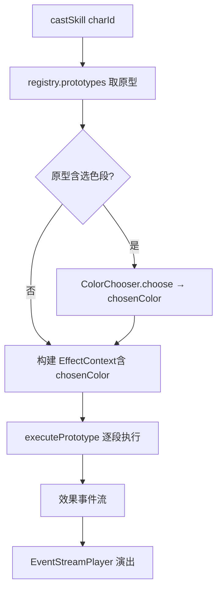
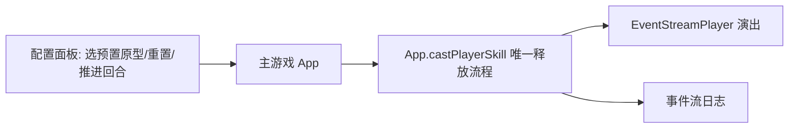

# 设计文档 · 技能编写与演出（skill-authoring）

## 概述

本设计在 `battle-skill-system` 的引擎底座之上，补齐：**手写技能内容（数据驱动）**、**主游戏技能释放全流程**、**表现层演出**、**测试页（主游戏的薄配置外壳）**。核心原则：技能 = 效果段的有序组合，逐条手写；**技能释放玩法只在主游戏 App 实现一次**，测试页复用之；表现层只消费事件；逻辑层纯净、确定性。

各部分关系（修订后）：

```
引擎层(纯逻辑)                    表现层
────────────                     ────────
executePrototype ← library/builders
castSkill ← ColorChooser/TargetChooser/CellChooser(AI 侧确定性实现)
                    │
                    ▼
              App.Cast_Flow(唯一释放流程) ── 短按释放/长按详情
                ├─ 玩家侧: ColorPickerBar / TargetPicker / CellPicker(选宝石)
                └─ EventStreamPlayer 演出 + CharacterCard 状态栏
                    │
              SkillTestPage = App + 配置面板(指定原型/重置/日志)  ← 不重写任何释放/演出
```

## 关键设计决策

1. **技能内容是手写数据，不是编译文本**：`SKILL_LIBRARY: Record<skillId, SkillPrototype>`，用 `builders.ts` 组装。放弃任何中文→技能的自动翻译。
2. **释放流程唯一实现于主游戏**：App 承载"触发 → 选色/选目标/选宝石 → castSkill → 演出"的完整 Cast_Flow。测试页只提供配置面板，复用 App 的这条流程。**杜绝第二套逻辑**（本次修订的核心，纠正原测试台自成一套的错误）。
3. **三类运行时选择，同构注入**：颜色/目标/宝石格分别用占位符 `CHOSEN` / `enemyChosen`·`allyChosen` / `chosenCell`；执行期由 `ColorChooser` / `TargetChooser` / `CellChooser` 解析。每类都有玩家交互实现与 AI 确定性实现，经 `TurnEngine.set*Chooser` 注入 castSkill；缺值时相关段安全跳过。
4. **玩家触发**：短按己方满法力角色卡 = 释放；长按 = 详情面板。由 `CharacterCard` 分辨短/长按并回调 App。
5. **召唤物逐技能定义**：引用兵种 refName / 随机族候选集 / 手写模板。
6. **表现层演出复用 EventStreamPlayer**：新效果事件作为新 case 接入同一 GSAP 时间线；全部程序化（FXLayer + GSAP + SVG），零美术素材。
7. **状态图标栏内建于 CharacterCard**：读 `Character.statuses` 渲染，随 `status-*` 事件增删。

## 一、引擎层设计

### 1.1 技能库与构造器（已起头）

`src/engine/skills/builders.ts`：把冗长的 `EffectSegment` 简化为短函数（`dmg`/`dmgSplash`/`dmgAll`/`trueDmg`/`heal`/`armor`/`attack`/`magic`/`mana`/`createGems`/`createSkulls`/`transform`/`destroyRows`/`destroyCols`/`destroyColor`/`inflict`/`extraTurn`/`summon`）。`skill(...segs)` 组装为 `SkillPrototype`，段顺序即书写顺序。

`src/engine/skills/library.ts`：`SKILL_LIBRARY: Record<number, SkillPrototype>`，key = 兵种 `spell.id`。`getSkillPrototype(spellId)` 查表，未命中返回 `undefined`（引擎回退仅扣法力）。

运行时接入：在装配引擎时，把库中原型按 `String(spellId)` 注册进 `ExtensionRegistry.prototypes`（`castSkill` 已支持）。角色的 `skillId` 需从 `'none'` 改为对应兵种 `spell.id` 的字符串——由数据适配器 `troopToCharacter` 填充。

### 1.2 选色机制 ColorChooser

新增 `src/engine/skills/colorChooser.ts`：

```typescript
export interface ColorChooser {
  /** 为一次技能释放选定一个颜色；无可选颜色返回 null */
  choose(state: GameState, casterId: number): BaseColor | null;
}
```

- **占位符**：`gems.ts` 的宝石段参数颜色支持特殊值 `'CHOSEN'`。执行期 `EffectContext` 携带一个已解析的 `chosenColor`，宝石原语遇到 `'CHOSEN'` 时用它。
- **AI 策略（确定性）**：选棋盘上现存数量最多的颜色；平局取 `ALL_BASE_COLORS` 固定序更靠前者。无任何颜色→null。用种子化 RNG 仅在需要打破随机平局时（本策略用固定序，不需随机，但接口保留 rng 以备扩展）。
- **玩家策略**：表现层弹出选色，回填一个 `FixedColorChooser(color)` 注入执行。
- **EffectContext 扩展**：新增可选 `chosenColor?: BaseColor`。`TurnEngine.castSkill` 在构建上下文前调用 `ColorChooser.choose` 得到该值。若技能不需选色则不调用。
- **无颜色回退**：`chosenColor` 为 null 时，依赖它的宝石段 `apply` 直接返回空事件（安全跳过）。

### 1.3 召唤物定义

扩展 `builders.ts` 的 `summon` 构造器与召唤段参数，使召唤物显式化：

```typescript
// 引用已有兵种（按 referenceName 从 troops 映射属性）
summon({ ref: 'Skeleton' })
// 随机族：候选兵种集合，执行期种子化选一个
summon({ randomOf: ['Goblin', 'GoblinRocket', ...] })
// 手写模板（不依赖 troops）
summon({ template: { name:'骸骨', maxHp:20, attack:8, ... } })
```

- 召唤物属性来源：`ref`/`randomOf` 经一个 `troopToSummonTemplate(refName)` 适配器（复用 `troops.ts` 的 `getTroopByRef` + `troopToCharacter` 精简版）得到属性模板；`template` 直接用。
- `randomOf` 用 `ctx.rng` 确定性选取（同候选 + 同种子 → 同选择）。
- 逻辑层不 import 数据文件的表现字段；召唤物模板只含引擎所需数值属性。
- `summonEffect` 维护「场上最多 4 人 + FIFO 召唤等待队列」：未满时追加队尾，满员时入队，阵亡后按入队顺序补到最下方。

### 1.4 引擎数据流



## 二、表现层设计

### 2.1 EventStreamPlayer 新增事件演出

在 `appendSegment` 的 switch 增加 case，全部程序化：

- **skill-damage**：目标卡处飘伤害数字（红字上浮淡出）+ 命中闪光/轻微 recoil；复用 `FXLayer.burst` 与卡片 `recoil`。派发 `onBattleEvent` 让 App 刷新血/甲显示。致死由随后的 `defeat` 事件走既有演出。
- **gem-create**：在目标格 `BoardView.addGem` 后播放"缩放淡入 + 微光"。
- **gem-transform**：对应精灵变色（换纹理）+ 一次高光脉冲。
- **gem-destroy**：复用消除的 `burst` + 缩小淡出，然后 `removeGem`；其后的 `gravity`/`refill` 事件自然接续（既有）。
- **buff**：目标卡处按 `stat` 上浮对应颜色数字（治疗绿、护甲青、攻击橙…）+ 卡面短光晕；派发事件让 App 刷新属性。
- **status-apply**：目标卡状态栏出现图标（弹入）。
- **status-tick**：DoT 时卡处闪对应色 + 扣血飘字。
- **status-expire**：状态图标淡出移除。
- **summon**：目标队伍对应位置卡片登场（淡入 + 缩放）；通知 App 重建该队视图以含新角色。

所有新 case 遵循既有约定：用 `tl.add()`/`tl.to()` 接入同一时间线（保证顺序、加速、跳过一致，需求 8）；目标卡/格子不存在时安全跳过（需求 8.5）。

### 2.2 CharacterCard 状态图标栏

`TeamView.ts` 的 `CharacterCard` 增加一个 `.status-strip` DOM 区（卡片一角，横排小图标）。

- `refresh()` 时按 `Character.statuses` 渲染图标；每种状态一个 SVG 符号 + 颜色：中毒(绿毒滴)、燃烧(橙火苗)、沉默(紫禁言)、冰冻(蓝冰晶)、眩晕(黄星)、诅咒(暗紫骷髅)。
- 提供 `statusIcon(statusId): svg` 纯映射函数（可单测，需求 6.5）。
- `applyStatusBadge/removeStatusBadge` 供 EventStreamPlayer 在 apply/expire 时驱动出现/消失动效。

### 2.3 主游戏释放流程 Cast_Flow（唯一实现）

在 `App` 内实现一个 `castPlayerSkill(charId)`，作为技能释放的唯一入口，测试页复用之：

```
castPlayerSkill(charId):
  1. 校验：等待输入 & 我方回合 & 该角色法力已满 & 可释放（未沉默/眩晕）
  2. 查原型 proto = registry.prototypes.get(skillId)
  3. 依需要收集玩家选择（缺一即取消、不消耗法力）：
       needsColor(proto)  → BoardColorPicker.pick(棋盘自选色) → FixedColorChooser
       needsTarget(proto) → TargetPicker.pick(候选卡)        → FixedTargetChooser
       needsCell(proto)   → CellPicker.pick(棋盘格)          → FixedCellChooser
     取消 → 还原 chooser、return
  4. engine.set*Chooser(...) 注入；events = engine.castSkill(charId)
  5. player.play(events) → refreshTeams → afterResolve
```

- **触发**：`CharacterCard` 区分短按/长按。短按且该卡为我方满法力 → `App.castPlayerSkill`；长按 → 详情面板（沿用既有 `openCharacterDetail`）。短/长按用 pointerdown 计时（如 >350ms 判长按）区分，触摸与鼠标统一。
- **敌方 AI**：`runEnemyTurn` 里若某角色法力满，同样走 `engine.castSkill`，但用默认 AI Chooser（不弹 UI）。释放与普攻交换共用既有解析与演出。
- **App 装配**：`init` 时 `registerSkillLibrary(registry.prototypes)` + `engine.setSummonResolver(troopToSummonTemplate)`，使主游戏真正拥有全部技能内容。

### 2.4 三类玩家选择 UI（统一棋盘瞄准语言）

- **BoardColorPicker**（GOW 标准选色）：进入选色态，鼠标扫过棋盘时**光标所在宝石的同色宝石全部高亮**，点击确认该颜色。固定颜色技能不走此流程（直接用固定色）。取代早期的弹窗式 ColorPickerBar。
- **TargetPicker**（已具）：高亮候选角色卡，点选返回 charId；点选期间临时开启卡片 pointer-events。
- **CellPicker**（新增）：进入"选宝石"态，高亮可选棋盘格，复用 `InputController`/`BoardView` 的点格能力，点一格返回 `CellPos`；点空白取消。

三者都返回"选择值或取消"，由 Cast_Flow 统一处理为 Fixed*Chooser 注入或取消释放。

### 2.5 选定宝石格机制 CellChooser（引擎）

- 新增 `src/engine/skills/cellChooser.ts`：`CellChooser.choose(state, casterId, rng) → CellPos | null`；AI 实现按确定性策略（如棋盘中心/首个非空格，design 固定）。
- 宝石段参数支持占位 `'CELL'`（如以选定格为中心引爆 3x3 / 摧毁该格）；`EffectContext.chosenCell` 承载；缺值安全跳过。
- 新增一个"以格为中心引爆"的宝石操作（destroyAround），或让 destroyLines/destroyColor 之外新增 `destroyAt(cell, radius)`。

## 三、测试页设计（主游戏的薄配置外壳）

`SkillTestPage` = 复用 `App`（或其可复用子集）+ 一层配置面板，入口 `skills-test.html` + `src/test-main.ts`。**不重写引擎装配、Cast_Flow、选择器接入或演出**。



- **配置面板**：把"当前施法者的 skillId 指向的原型"临时设为选定预置原型（写入 registry.prototypes 的一个测试键，并把该角色 skillId 指向它），然后调用**主游戏的** `castPlayerSkill`。
- **预置原型**：覆盖需求 9.2 列表（含选定目标/选定宝石）。
- **重置**：固定种子重建 App 场景（或复用 App 的重置能力）。
- **推进回合 / 事件日志**：观察 DoT 结算与到期；日志订阅同一条事件流。
- **选择交互**：需选色/目标/宝石时，弹出的是主游戏同款 UI（ColorPickerBar/TargetPicker/CellPicker）。

## 数据模型（新增/改动）

- `EffectContext` 增 `chosenColor?: BaseColor`（context.ts）。
- 宝石段颜色字段允许 `BaseColor | 'CHOSEN'`（gems.ts / builders.ts）。
- 召唤段参数扩展为 `{ ref } | { randomOf } | { template }`（summon.ts / builders.ts）。
- `Character.skillId` 由数据适配器填为兵种 `spell.id` 字符串（troops.ts）。
- 表现层 `StatusBadge` 映射表（statusId → {icon, color, label}）。

## 正确性属性（Correctness Properties）

来自 prework 的可测项，落为属性/示例测试：

- **P1（选色确定性，需求 2.3/2.7/10.3）**：相同 `GameState` + 相同种子 + 相同 chooser → `choose` 返回相同颜色；且 AI 策略返回的颜色是棋盘现存数量最多者（平局取固定序更前）。（property）
- **P2（构造器合法性，需求 1.2/1.3）**：任意合法参数下，各 builder 产出的段 `kind` 与必填字段合法；`skill(a,b,c)` 的 segments 顺序恒等于入参顺序。（property）
- **P3（随机召唤确定性，需求 7.4）**：给定候选集 + 相同种子，召唤选取结果相同。（property）
- **P4（释放确定性，需求 10.3）**：相同状态 + 种子 + 选色，`castSkill` 产出完全相同事件流。（property）
- **P5（演出不改引擎状态，需求 10.2）**：对任意事件流，`EventStreamPlayer.play` 前后引擎 `GameState` 的数值快照不变。（example/property）
- **P6（无颜色/满队召唤安全，需求 2.6/7.6/8.5）**：空棋盘选色、满队召唤入队、目标缺失事件 → 不抛异常、不产非法效果。（edge-case）

## 测试策略

### 单元测试（逻辑层，vitest）
- 技能库：已配置 skillId 取到预期原型（1.1）；未配置回退（1.5）；代表技能端到端释放产出正确事件（1.4）。
- builders：各构造器产出结构正确（1.2）。
- ColorChooser：AI 选最多色、平局固定序、空棋盘 null（2.1/2.5/2.6）。
- 召唤物：ref/template/randomOf 三路径属性正确、满 4 人后 FIFO 入队、阵亡后从队首补到场上队尾（7.1/7.2/7.3/7.6）。
- statusIcon 映射（6.5）。

### 属性测试（fast-check）
- P1–P6 上述属性。

### 端到端（Playwright，测试台）
- 逐类技能：选中→释放→截图快照，肉眼 + 快照回归（3.x/4.x/5.x/6.x/7.5/9.x）。
- 事件日志内容断言（9.5）、状态图标出现/消失断言（6.2/6.4）、推进回合看 DoT（9.7）。

### 手动点验
- 演出手感（时序、加速、跳过一致性）在测试台上过一遍。

## 项目结构（新增/改动）

```
src/engine/skills/
  builders.ts        # 简写构造器（已建，需扩展 summon/选色）
  library.ts         # 手写技能表（已建，持续扩充）
  colorChooser.ts    # 选色机制（新增）
  effects/context.ts # 增 chosenColor（改）
  effects/gems.ts    # 支持 'CHOSEN'（改）
  effects/summon.ts  # 召唤物定义解析（改）
src/data/
  troops.ts          # skillId 填 spell.id、召唤物模板适配（改）
src/render/
  EventStreamPlayer.ts   # 新效果事件演出（改）
  TeamView.ts            # CharacterCard 状态图标栏（改）
  statusBadges.ts        # 状态图标 SVG 映射（新增）
  SkillTestHarness.ts    # 测试台（新增）
  ColorPickerBar.ts      # 选色条 UI（新增）
skills-test.html + src/test-main.ts  # 测试台入口（新增）
tests/unit/ , tests/property/         # 对应测试
tests/e2e/ 或 playwright               # 测试台端到端
```
