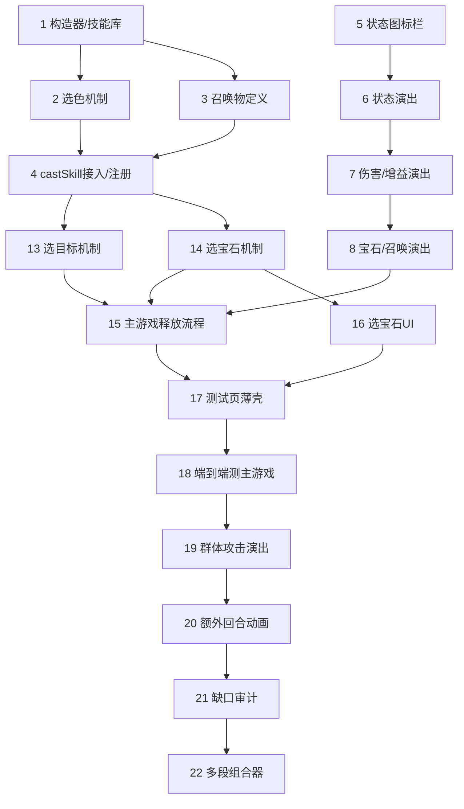

# 实施计划 · 技能编写与演出

## 说明

> 自底向上：先夯实引擎层（技能库/选色/召唤物），再补表现层演出，最后搭测试台串起来验证。
> 逻辑层 `src/engine` 禁止 import pixi/gsap/dom。标 `*` 为可选/属性测试任务。
> 测试框架：Vitest + fast-check；端到端用 Playwright（测试台）。

## 任务

### 第 0 批 · 引擎层：内容与机制

- [x] 1. 完善技能构造器与技能库骨架 `src/engine/skills/builders.ts` + `library.ts`
  - 校对已有构造器（dmg/heal/createGems/inflict 等）字段与 `EffectSegment` 对齐
  - 补 `summon` 构造器的召唤物参数形态：`{ ref } | { randomOf } | { template }`
  - 补选色占位：宝石相关构造器颜色参数允许 `'CHOSEN'`
  - `getSkillPrototype(spellId)` 查表、未命中返回 undefined
  - 单元测试：已配置取到预期原型、未配置返回 undefined、skill(...) 段顺序 = 书写顺序
  - _需求: 1.1, 1.2, 1.3, 1.4, 1.5, 1.6_

- [x]* 1.1 构造器属性测试
  - 属性：任意合法参数下各 builder 产出段 kind/必填字段合法；skill(a,b,c) 顺序恒等入参顺序
  - _需求: 1.2, 1.3_

- [x] 2. 实现选色机制 `src/engine/skills/colorChooser.ts`
  - `ColorChooser` 接口；`AiColorChooser`（棋盘现存最多色、平局取 ALL_BASE_COLORS 固定序、空棋盘 null）；`FixedColorChooser(color)`
  - `EffectContext` 增 `chosenColor?: BaseColor`；`gems.ts` 遇 `'CHOSEN'` 用 `ctx.chosenColor`，为 null 则安全跳过
  - 单元测试：AI 选最多色、平局固定序、空棋盘 null、CHOSEN 段按选定色执行、无色跳过
  - _需求: 2.1, 2.2, 2.5, 2.6_

- [x]* 2.1 选色确定性属性测试
  - 属性：相同 state+种子+chooser → choose 返回相同颜色；AI 结果恒为现存最多色
  - _需求: 2.3, 2.7_

- [x] 3. 实现召唤物定义解析 `src/engine/skills/effects/summon.ts` + `src/data/troops.ts`
  - `summon` 段支持 ref/randomOf/template 三来源；`troopToSummonTemplate(refName)` 从兵种取引擎所需属性
  - randomOf 用 `ctx.rng` 确定性选一个；场上最多 4 人，满员后进入 FIFO 召唤队列
  - 单元测试：三来源属性正确、随机族同种子同结果、满员入队与阵亡顺序补位
  - _需求: 7.1, 7.2, 7.3, 7.6_

- [x]* 3.1 随机召唤确定性属性测试
  - 属性：给定候选集 + 相同种子，召唤选取结果相同
  - _需求: 7.4_

- [x] 4. 接入 castSkill 选色与技能库注册 `src/engine/TurnEngine.ts` + `src/data/troops.ts`
  - `castSkill`：原型含选色段时先调用注入的 `ColorChooser.choose` 得 `chosenColor` 再执行
  - 数据适配器 `troopToCharacter` 把 `skillId` 填为兵种 `spell.id` 字符串；提供把 `SKILL_LIBRARY` 注册进 `ExtensionRegistry.prototypes` 的装配函数
  - 单元测试：含选色技能端到端按选定色生效；库技能经注册被 castSkill 执行
  - _需求: 1.4, 2.2, 2.5_

- [x]* 4.1 释放确定性属性测试（集中）
  - 属性：相同状态+种子+选色 → castSkill 产出完全相同事件流
  - _需求: 10.3_

### 第 1 批 · 表现层：状态图标与效果演出

- [x] 5. 状态图标映射与角色卡状态栏 `src/render/statusBadges.ts` + `src/render/TeamView.ts`
  - `statusIcon(statusId)` 纯映射：中毒/燃烧/沉默/冰冻/眩晕/诅咒 各一 SVG + 颜色
  - `CharacterCard` 增 `.status-strip`，`refresh()` 按 `Character.statuses` 渲染；`applyStatusBadge/removeStatusBadge` 动效
  - 单元测试：statusIcon 映射覆盖各状态、未知状态有兜底
  - _需求: 6.1, 6.5, 6.6_

- [x] 6. EventStreamPlayer 补状态事件演出 `src/render/EventStreamPlayer.ts`
  - `status-apply` 图标弹入、`status-tick` DoT 闪光+扣血飘字、`status-expire` 图标淡出
  - 目标卡不存在时安全跳过；派发 onBattleEvent 让 App 刷新
  - _需求: 6.2, 6.3, 6.4, 8.1, 8.2, 8.5_

- [x] 7. EventStreamPlayer 补伤害/增益演出 `src/render/EventStreamPlayer.ts`
  - `skill-damage` 伤害飘字+命中反馈（复用 burst/recoil），接既有 defeat
  - `buff` 按 stat 上浮对应色数字+卡面光晕，刷新属性显示
  - _需求: 3.1, 3.2, 3.3, 3.4, 5.1, 5.2, 5.3_

- [x] 8. EventStreamPlayer 补宝石/召唤演出 `src/render/EventStreamPlayer.ts`
  - `gem-create` 淡入、`gem-transform` 变色脉冲、`gem-destroy` 爆裂淡出并接续 gravity/refill
  - `summon` 目标队伍新卡登场并重建队伍视图；演出后棋盘精灵与引擎终态一致
  - _需求: 4.1, 4.2, 4.3, 4.4, 4.5, 7.5, 7.7, 8.3, 8.4_

- [ ]* 8.1 演出不改引擎状态属性测试
  - 属性：任意事件流经 play 前后引擎 GameState 数值快照不变
  - _需求: 10.2_

### 第 2 批 · 选色 UI 与测试台

- [x] 9. 选色条 UI `src/render/ColorPickerBar.ts`
  - 展示棋盘现存 6 色可选项，点选回调；供 App/测试台在需选色技能释放前调用，注入 FixedColorChooser
  - _需求: 2.4_

- [x] 10. 技能测试台页面 `src/render/SkillTestHarness.ts` + `skills-test.html` + `src/test-main.ts`
  - 独立页面：左右两队 + 棋盘（固定种子初始局面）
  - 预置技能类型菜单（单体/群体/溅射/真实伤害、创造/摧毁行列/摧毁指定色/转化、治疗/加护甲/加攻击、中毒/燃烧/沉默/冰冻、额外回合、召唤），一键释放
  - 重置局面、推进回合（驱动状态结算）、事件流日志面板、需选色时弹选色条
  - _需求: 9.1, 9.2, 9.3, 9.4, 9.5, 9.6, 9.7_

- [x]* 11. 测试台端到端快照 `tests/e2e/skills.spec.ts`
  - Playwright：逐类技能选中→释放→截图；断言事件日志内容、状态图标出现/消失、推进回合后 DoT 生效
  - _需求: 10.5, 6.2, 6.4, 9.5, 9.7_

- [x] 12. 首批真实技能配置与验证 `src/engine/skills/library.ts`
  - 手写配置一批代表性兵种技能（覆盖各效果类型，含 1 个选色技能、1 个召唤技能）
  - 每条对照中文原文注释；单元测试断言若干已知技能释放产出正确事件
  - _需求: 1.1, 1.4, 2.5, 7.2_

### 第 3 批 · 架构修订：释放流程归位主游戏 + 测试页薄壳 + 选目标/选宝石

> 修正：原测试台自成一套释放/演出逻辑（错误）。本批把技能释放全流程做进主游戏 App，
> 测试页改为 App 的薄配置外壳；补玩家选目标（已在引擎就绪）与选宝石格。

- [x] 13. 引擎：玩家选目标机制 `src/engine/skills/targeting.ts` + `targetChooser.ts`
  - `enemyChosen`/`allyChosen` 目标模式 + `candidatesFor`；`TargetChooser`（AI 选最弱/最低血、Fixed 玩家选）
  - `EffectContext.chosenTargetId`、prototypes 传参、`castSkill` 注入、`prototypeChosenTargetMode`
  - 单元测试：选定模式取 chosenId、AI 策略、端到端 castSkill 按选定目标生效
  - _需求: 2A.1-2A.7_

- [x] 14. 引擎：玩家选宝石格机制 `src/engine/skills/cellChooser.ts` + `effects/gems.ts`
  - `CellChooser`（AI 确定性 + Fixed 玩家）；宝石段支持 `'CELL'` 占位 + `EffectContext.chosenCell`
  - 新增"以选定格为中心引爆/摧毁"宝石操作（destroyAt(cell, radius)）；缺值安全跳过
  - 单元测试：选定格引爆正确、无格跳过、AI 策略确定性
  - _需求: 2B.1-2B.7_

- [x] 15. 主游戏释放流程 `src/render/App.ts` + `CharacterCard`
  - App `init` 注册技能库 + 召唤解析器；实现 `castPlayerSkill(charId)` 唯一释放流程
  - `CharacterCard` 短按/长按区分：短按己方满法力→释放、长按→详情
  - 释放流程按需依次收集选色/选目标/选宝石（玩家 UI），取消则不消耗法力；敌方 AI 复用 castSkill
  - _需求: 2C.1-2C.7, 2A.3, 2B.3_

- [x] 16. 选宝石 UI `src/render/CellPicker.ts` + 接入 App/TargetPicker 复用
  - 进入"选宝石"态高亮可选格、点格返回 CellPos、点空白取消（复用 BoardView/InputController）
  - _需求: 2B.3_

- [x] 17. 测试页重构为主游戏薄壳 `src/render/SkillTestPage.ts`（替换 SkillTestHarness）
  - 复用 App 的场景/Cast_Flow/演出；仅加配置面板：指定当前施法者原型、重置、推进回合、事件日志
  - 删除 SkillTestHarness 中重写的释放/演出/选择逻辑；预置原型含选目标/选宝石
  - _需求: 9.1-9.7_

- [x] 18. 端到端改测主游戏 `tests/e2e/skills.spec.ts`
  - 直接在主游戏页面：短按满法力卡释放、选目标/选色/选宝石、断言事件与状态；长按开详情
  - _需求: 10.5, 2C.1, 2C.2, 2A.3, 2B.3_

### 第 4 批 · 技能演出细化（序列帧素材版，见 ANIMATION_HANDOFF §19）

> 第 0-3 批的引擎与"零素材程序化演出"骨架已全部完成并通过。本批按 ANIMATION_HANDOFF
> 用「特效500个【png】」序列帧素材，对具体技能演出做专属化与缺口补齐。
> 链路铁律不变：引擎发事件 → EventStreamPlayer 排时序 → App/BoardView 画面；引擎不 import 表现层。
> 素材统一经 `scripts/build_fx_strip.ps1` 拼成横向 strip，登记进 `App.FRAME_FX_URL` + `AnimConfig.frameFX`。

- [x] 19. P0-1 群体攻击专属演出（ANIMATION_HANDOFF §19 P0-1）
  - 群体伤害不走通用弹道；先在棋盘中央播放 0241 群攻释放动画，再让所有存活目标同时出现大范围受击动画
  - 按施法者主颜色选群体受击素材：紫 0475 / 红 0449 / 蓝 0344 / 黄 0318 / 棕 0334 / 绿 0349
  - 受击范围要大（覆盖整卡而非头像中心一小块）；颜色受击音效同批只播一次，避免多份采样叠加削波
  - 表现层聚合连续 `range='all'` 的 `skill-damage` 为「一次释放 + 同时命中」；同时飘伤害数字并刷新卡片
  - 生成 strip 并登记；EventStreamPlayer 识别群攻批次并预留 Timeline；App 播放释放/群体受击
  - _需求: 3.1, 3.2, 3.4, 8.1, 8.2, 8.5_

- [x] 20. P0-2 额外回合动画（ANIMATION_HANDOFF §19 P0-2）
  - 使用 0082 号动画，棋盘中央播放，与 `extra-turn` 事件绑定，只播放一次
  - Timeline 等待关键表现结束；不破坏现有回合归属/HUD/连击音效逻辑（0082 是新增视觉层）
  - 生成 strip 并登记；EventStreamPlayer `extra-turn` 分支预留时长；App `onBattleEvent` 播放
  - _需求: 8.1, 8.2_

- [x] 21. P1-1 基础技能组件动画/音效缺口审计（ANIMATION_HANDOFF §19 P1-1）
  - 按 `EffectSegment` / `GameEvent` 全量审计（不按测试页按钮猜），输出缺口表：
    `组件/事件 | 逻辑已完成 | 动画已完成 | 音效已完成 | 是否专属 | 缺口 | 优先级`
  - 重点确认：真实伤害是否区分、加攻击/魔法/法力是否仅飘字、沉默/眩晕/诅咒是否仅徽标、
    `status-tick` 毒/火持续伤害是否需专属动画/音效、宝石创建/转化/摧毁是否按类型补音效
  - 产出审计表后与用户确认再补齐（补齐拆为后续子任务）
  - _需求: 3-8 全量_

- [x] 22. P1-2 测试控制台多段技能组合器（ANIMATION_HANDOFF §19 P1-2）
  - 在 `SkillTestPage` 增加组合面板：施法者主颜色/目标模式/效果段列表（增删排序）/伤害数值/附加状态/群体·溅射·真伤/宝石·增益·额外回合·召唤
  - 至少预设：蓝单体+冰冻、单体+中毒、红单体+燃烧、群体+全体燃烧、伤害+控制、伤害+宝石爆破、伤害+额外回合
  - 控制台只组装 `SkillPrototype` 并调用正式释放链路（禁止直接调 `playFrameFX`/`audio.play`）
  - 验收：事件日志顺序=效果段顺序；伤害后才播状态动画；每段音效绑自己视觉帧；取消选目标不消耗法力
  - _需求: 9.1-9.7, 2C.7_

## 依赖关系

**关键路径**：引擎+演出骨架(1-18 已完成) → 19(群体攻击) → 20(额外回合) → 21(缺口审计) → 22(多段组合器)。

## 附录 A · 基础技能组件动画/音效缺口审计（任务 21 产出）

> 按 `GameEvent` 全量审计（源自 `src/engine/events.ts`），逐条核对 `EventStreamPlayer` + `App.onBattleEvent` 的演出与 `AudioManager` 的音效。
> 「专属」= 是否按颜色/类型/状态做了区分演出，而非统一兜底。

| 事件 / 子类 | 逻辑 | 动画 | 音效 | 专属 | 缺口 | 优先级 |
|---|---|---|---|---|---|---|
| skill-cast | ✅ | ⚠️ 仅音效，无施法视觉 | ✅ 棕=土/其余=skill | 半 | 无施法起手动画（法阵/蓄力光） | P3 |
| skill-damage · single | ✅ | ✅ 弹道+按色受击帧 | ✅ 按色单体受击音 | ✅ | — | — |
| skill-damage · all（群体） | ✅ | ✅ 0241释放+按色群体受击（任务19） | ✅ 按色受击音，整批一次 | ✅ | — | — |
| skill-damage · splash | ✅ | ✅ 0083释放+0002飞剑+0406受击 | ✅ splashChainHit | ✅ | — | — |
| skill-damage · trueDamage | ✅ | ⚠️ 与普通单体/群体同演出 | ⚠️ 同上 | ❌ | 真伤无区别标识（无护甲穿透视觉/白字） | P2 |
| buff · hp（治疗） | ✅ | ✅ 0287光柱 | ✅ healing | ✅ | — | — |
| buff · armor（护甲） | ✅ | ✅ 0306盾柱 | ✅ armor | ✅ | — | — |
| buff · attack | ✅ | ⚠️ 仅飘字 | ❌ 无 | ❌ | 无攻击强化视觉/音效 | P2 |
| buff · magic | ✅ | ⚠️ 仅飘字 | ❌ 无 | ❌ | 无魔法强化视觉/音效 | P2 |
| buff · mana | ✅ | ⚠️ 仅飘字 | ❌ 无 | ❌ | 无法力增益视觉/音效 | P3 |
| status-apply · poison | ✅ | ✅ 0340毒环+徽标 | ✅ poison | ✅ | — | — |
| status-apply · burning | ✅ | ✅ 0450火焰+徽标 | ✅ burning | ✅ | — | — |
| status-apply · frozen | ✅ | ✅ 0058冰晶+徽标 | ✅ frozen | ✅ | — | — |
| status-apply · silence | ✅ | ⚠️ 仅徽标弹入 | ❌ 无 | ❌ | 无施加瞬间专属动画/音效 | P2 |
| status-apply · stun | ✅ | ⚠️ 仅徽标弹入 | ❌ 无 | ❌ | 无施加瞬间专属动画/音效 | P2 |
| status-apply · curse | ✅ | ⚠️ 仅徽标弹入 | ❌ 无 | ❌ | 无施加瞬间专属动画/音效 | P2 |
| status-tick · poison/burning（DoT） | ✅ | ⚠️ 仅飘扣血字+刷新 | ❌ 无 | ❌ | 每回合持续伤害无专属动画/音效 | P1 |
| status-cleanse（驱散） | ✅ | ✅ 0287光+移除徽标 | ✅ healing | 半 | 复用治疗演出，非专属净化视觉 | P3 |
| status-expire | ✅ | ✅ 徽标淡出 | ❌ 无（合理） | — | — | — |
| gem-create | ✅ | ✅ 缩放淡入+粒子 | ❌ 无 | ❌ | 创造宝石无音效 | P2 |
| gem-transform | ✅ | ✅ 变色脉冲+粒子 | ❌ 无 | ❌ | 转化宝石无音效 | P2 |
| gem-destroy（摧毁） | ✅ | ✅ 碎裂缩放淡出 | ❌ 无 | 半 | 摧毁无专属音效（区别于爆破） | P2 |
| gem-explode（爆破） | ✅ | ✅ 0046能量爆+外溅 | ✅ gemExplosion | ✅ | — | — |
| summon · field | ✅ | ✅ 0011召唤符印 | ✅ summon | ✅ | — | — |
| summon · queue | ✅ | ✅（不建卡，合理） | —（合理） | — | — | — |
| extra-turn | ✅ | ✅ 0082棋盘中央（任务20） | ✅ 连击音阶梯 | ✅ | — | — |
| defeat | ✅ | ✅ 0353阵亡飘散 | ✅（沿用） | ✅ | — | — |

**结论（待用户确认后拆子任务补齐）**：
- **P1**：`status-tick`（毒/火每回合持续伤害）目前只飘字，缺专属持续伤害动画/音效 —— 观感最弱，建议优先补。
- **P2**：真伤区分、加攻击/加魔法专属反馈、silence/stun/curse 施加瞬间演出、gem create/transform/destroy 音效。
- **P3**：skill-cast 起手动画、加法力反馈、净化专属视觉。

> 说明：以上「缺口」均为**表现层增强**，不影响引擎逻辑正确性（逻辑列全部 ✅）。补齐前需用户确认取哪些素材/音源，再逐条拆子任务。

## 备注

- **手写优先**：技能内容一律手写配置，中文只作注释，绝不做文本自动编译。
- **演出素材**：第 0-3 批为程序化零素材骨架；第 4 批起按 ANIMATION_HANDOFF 引入序列帧 strip 做专属化。
- **测试台是验收核心**：逐类技能在页面上点验，是"引擎+表现层都对"的最终证据。
- **素材规则**：只在用户明确给出的本地目录取素材；不确定裁剪/版本先问用户；原始素材不删除。
